# Harness Engineering

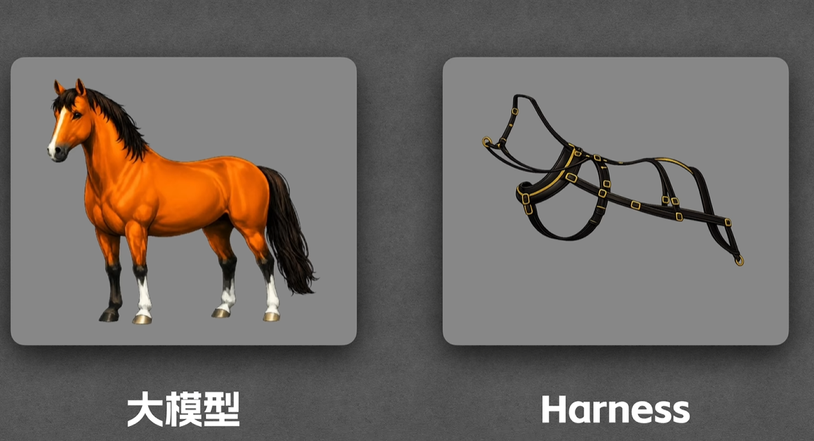

除了大模型以外的东西都可以认为是harness

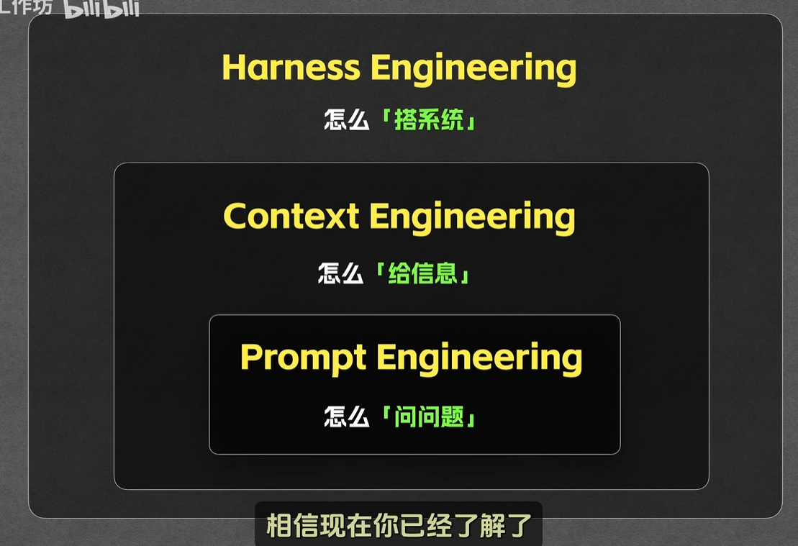

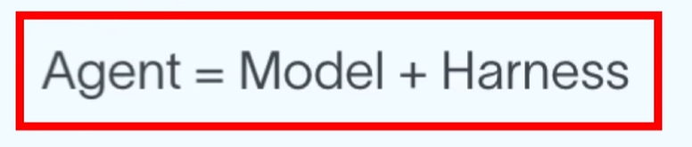

# OpenAI的实践

## 上下文管理

不要把所有规范等等塞到agent.md中, 而是将agent.md当作目录, 需要的时候自己再查阅.

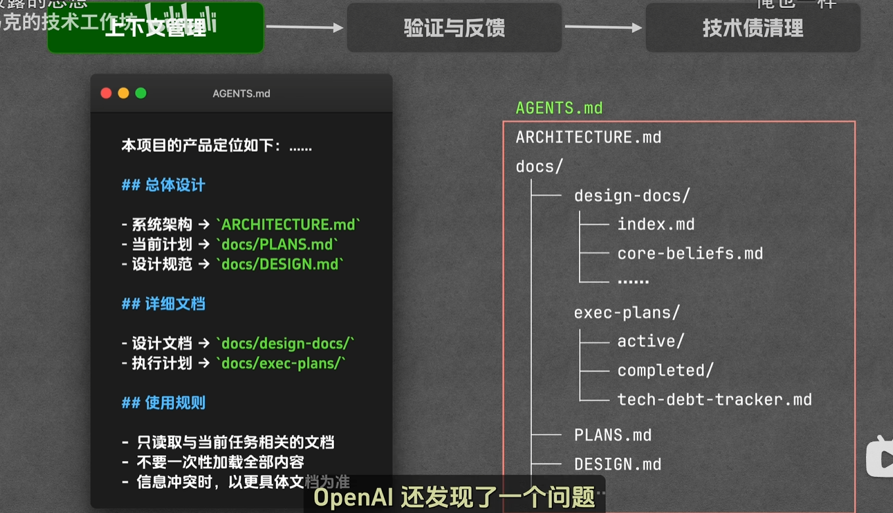

同时, 让仓库本身成为唯一的事实来源. 而不是塞在提示词中.

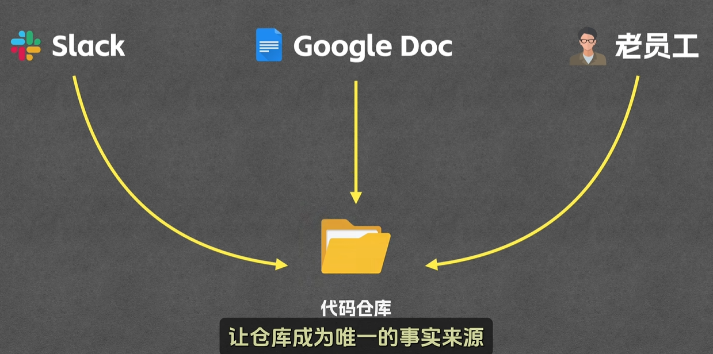

## 验证与反馈

给agent配备能够验证的工具与skill.

还可以引入外部的review机制.

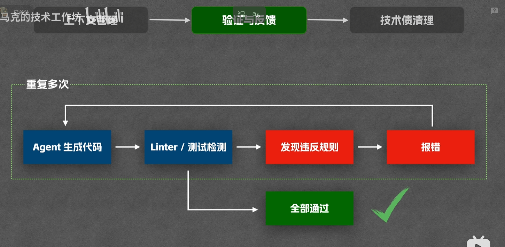

## 技术债清理

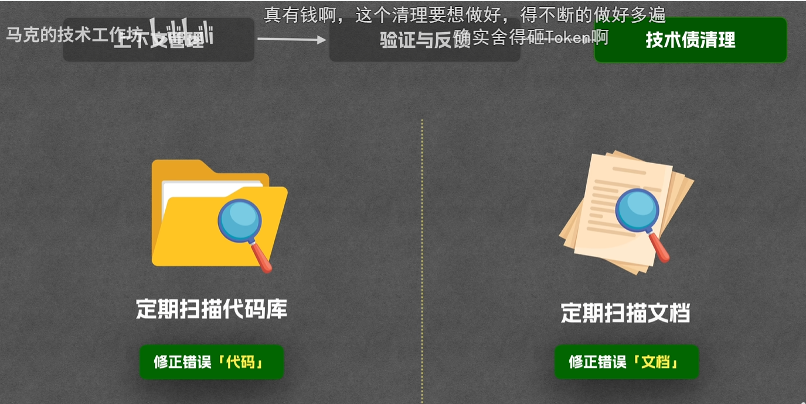

## 结论

新时代软件工程师, 更多的是为agent搭建框架.

# Anthropic的实践

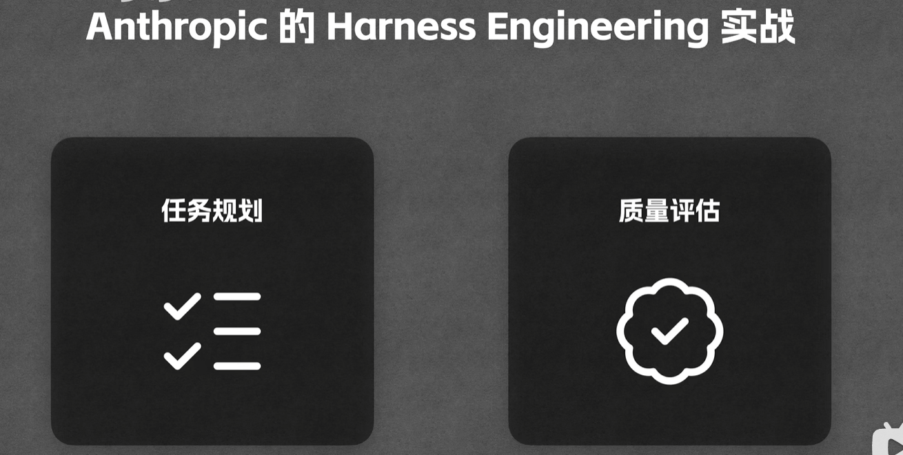

## 任务规划

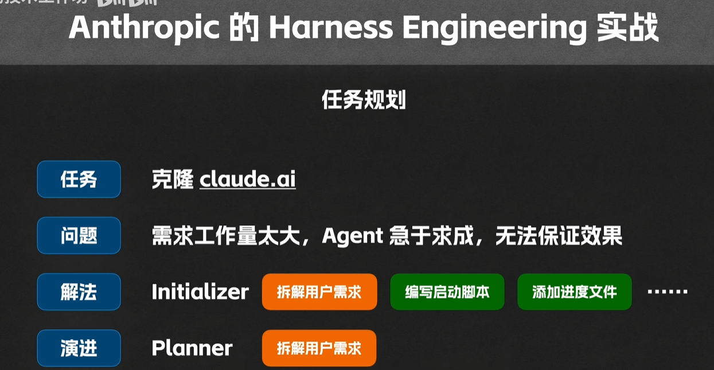

## 质量评估

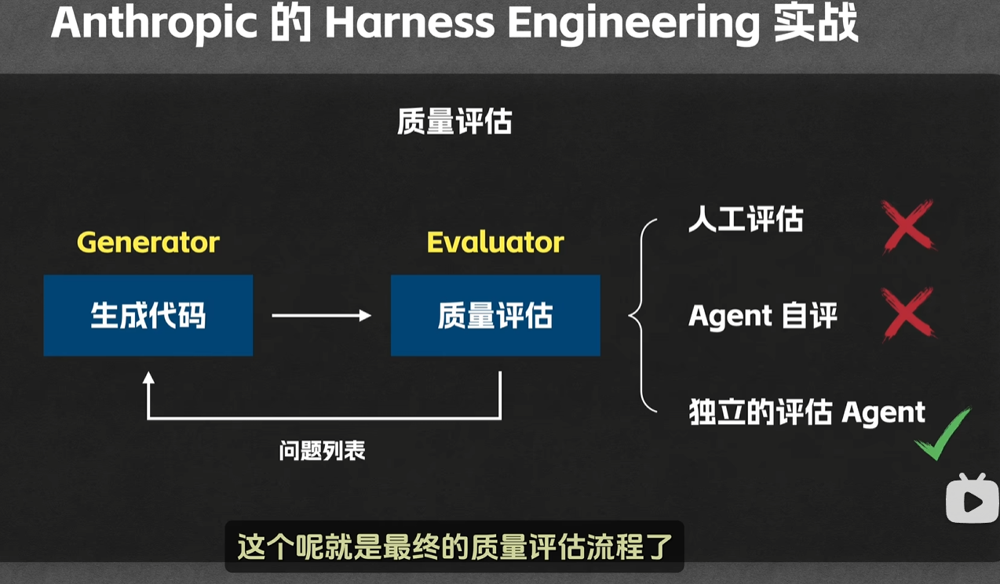

## 流程

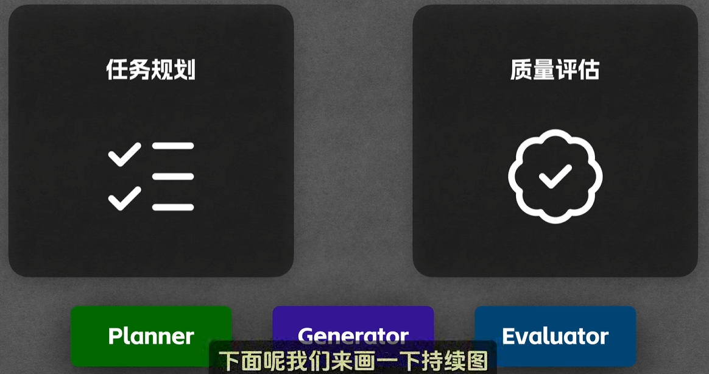

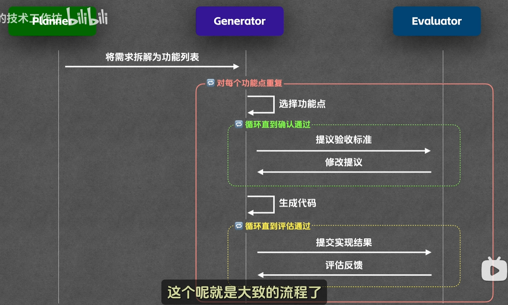

等4.6出来之后, 将"逐功能点"简化为了generator一次性生成全部代码, 然后直接评估.

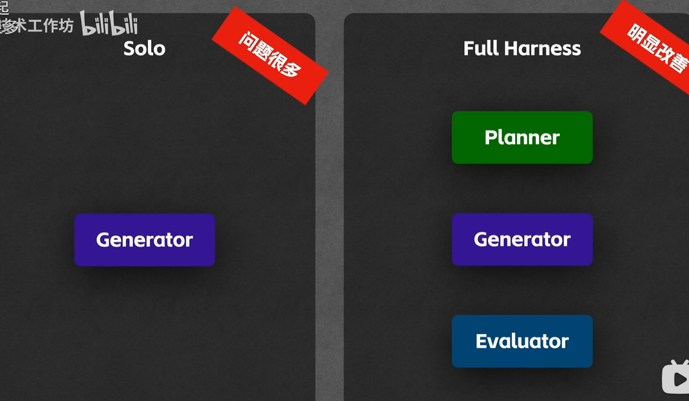

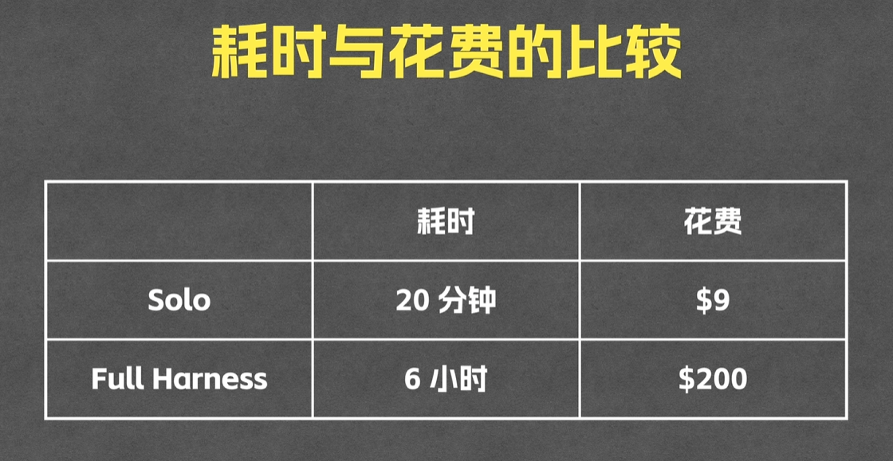

# 个人观点

harness engineering颇有一种让agent开发成为一个真正有价值的岗位, 的感觉.

一个比喻就是, CPU再牛逼也需要操作系统. 操作系统设计的各种调度等等, 充分发挥CPU的能力.

那agent开发这块其实也一样, 只要还是基于LLM的这套理论, 那么agent还是必不可少的. 进一步拓展来说, 不仅是代码开发, 如果将LLM放在其他环境, 例如游戏内, 现实世界中, 那么同样需要大量的agent工程做适配.

那这样的话我还是挺看好agent开发的.
