# MCP

# 基础

选择Cline作为MCP host

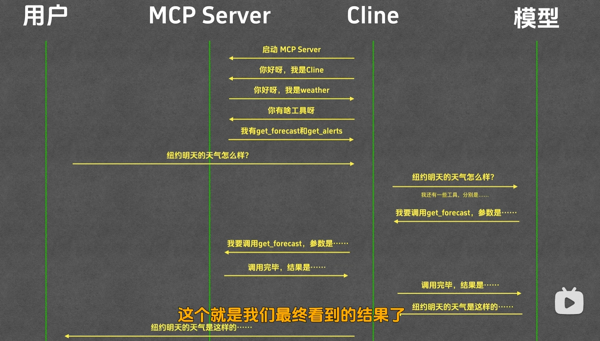

下面这个是自己写的MCP server. 简单来说启动MCP server就是在终端输入command, 以及args.

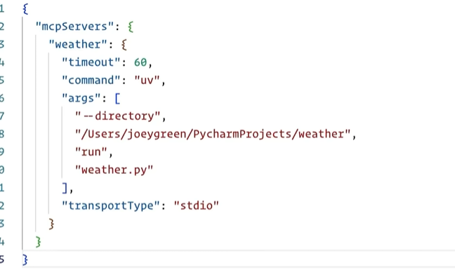

如果是用别人的MCP server, 那配置好像更简单.

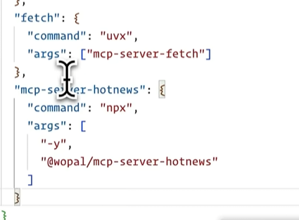

# 开发MCP Server

用python开发为例, 安装依赖.

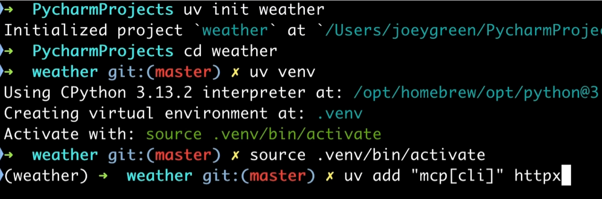

创建weather.py文件, 利用FastMCP创建一个对象.

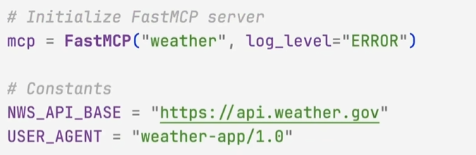

写好自己的工具, 添加@mcp.tool()装饰器, 它会将函数注册为tool, 将函数注释作为tool的描述(比如这个函数的功能, 每个参数的功能).

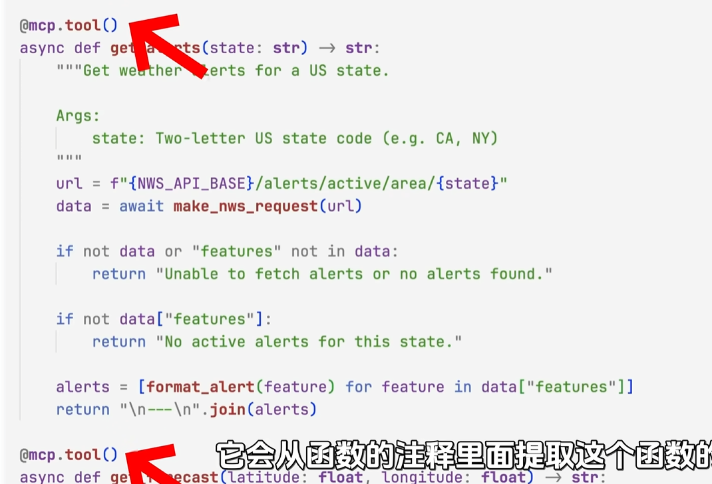

写main函数, 当程序启动的时候运行mcp.

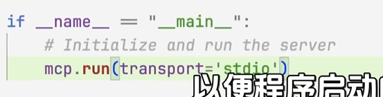

然后在配置文件中配置即可.


不过FastMCP背后做了什么? 我们拦截MCP Host和MCP Server的交互, 将交互信息打印出来.

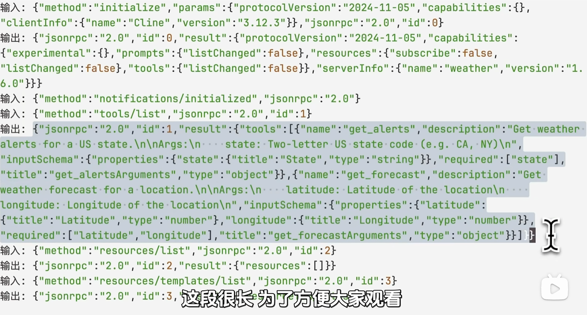

## **MCP 三次握手**

互相告知版本号等信息, 完成初始化

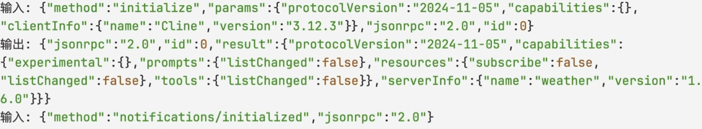

然后就可以开始交互了. 可以看到MCP Host这边是调用了list这个函数, 让MCP Server将工具列出来.

格式化MCP Server返回的结果, 截取其中一个工具:

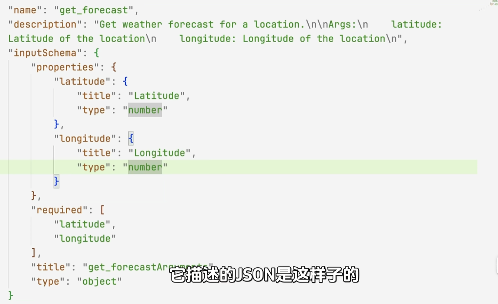

可以看到description就是函数注释, 然后下面有个InputSchema, 这个是json schema. 这个InputSchema也是根据函数参数提取出来的

## json schema

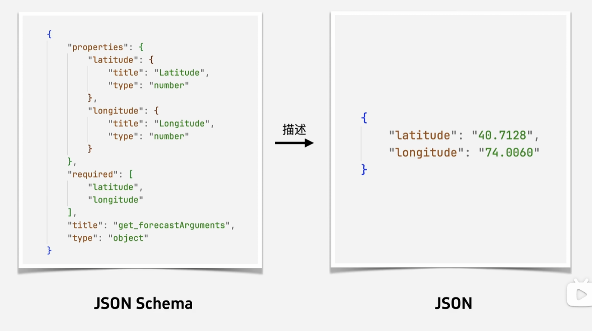

规定了一个json的格式.

调用函数的时候, MCP Host发送给MCP Server的call指令, 就会附带一个符合这个schema的json作为参数.

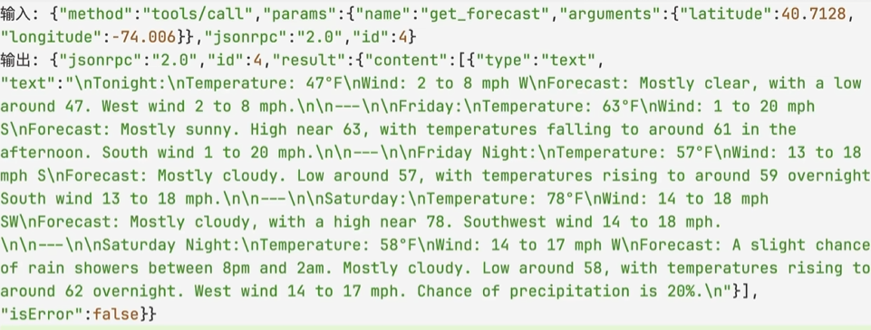

## 直接与MCP Server沟通

直接自己用uv指令启动这个MCP Server, 然后按照上面的日志来即可.

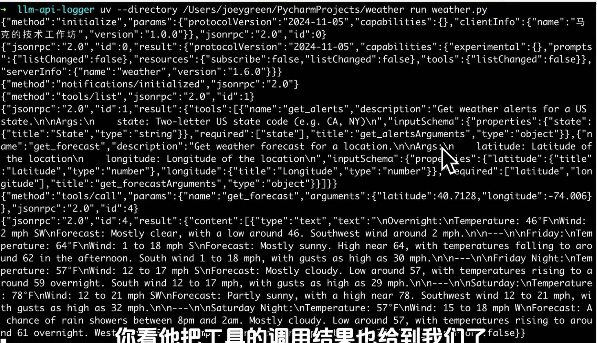

# MCP vs FunctionCall

## Function Call 是什么

调用模型的时候，用 JSON 的形式告诉它：我有哪些函数、每个函数有哪些参数。模型如果判断需要调用某个函数，就返回一段符合格式的 JSON，里面写明调用哪个函数、传什么参数。

下面的tools传给了模型, 实际上就是function call

```python
tools = [
  {
    "type": "function",
    "function": {
      "name": "get_current_weather",
      "description": "Get the current weather in a given location",
      "parameters": {
        "type": "object",
        "properties": {
          "location": {
            "type": "string",
            "description": "The city and state, e.g. San Francisco, CA",
          },
          "unit": {"type": "string", "enum": ["celsius", "fahrenheit"]},
        },
        "required": ["location"],
      },
    }
  }
]
messages = [{"role": "user", "content": "What's the weather like in Boston today?"}]
completion = client.chat.completions.create(
  model="gpt-5",
  messages=messages,
  tools=tools,
  tool_choice="auto"
)
```

## 两者的关系

**MCP不需要function call也能工作**. 只需要遵循MCP Server中规定好的Input Schema即可正确调用MCP Server提供的工具.

举例来说, MCP Host让MCP Server列出来可用的工具, 以及InputSchema, 然后将这些信息添加到System Prompt, 告诉模型调用工具的格式长啥样. 模型返回对应的格式, MCP Host解析模型的返回结果, 调用MCP Server的工具.

而有了function call, 就不用在system prompt中把MCP Server提供的一大堆信息都塞进去, 而是解析成FunctionCall的格式, 调用模型的时候传给他, 然后解析模型返回的结果, 再转成MCP Server规定的格式, 然后调用MCP Server的工具.

所以function call实际上解决了模型返回结果可能不严格遵循格式的问题(用提示词约束是很不稳定的, 而function call实际上是模型专门做过适配的)

---

## 原生商用 Function Call（核心是模型修改 + 配套优化）

目前 OpenAI、Anthropic、国内主流大模型厂商提供的原生函数调用能力，均采用这套方案，核心改动集中在模型本身，提示词仅为辅助：

**核心：专项有监督微调（SFT）**

用海量高质量的「用户 Query - 调用决策 - 函数参数生成 - 结果整合」配对数据，对基座模型进行针对性微调，让模型真正学会：什么时候该调用工具 / 直接回答、该调用哪个函数、如何生成符合 schema 规范的参数、如何处理工具返回结果并整合出最终答案。这是 Function Call 能力的核心，没有微调的基座模型，仅靠提示词永远无法达到稳定的商用效果。

**结构与推理侧适配优化**

多数厂商会做额外的模型层面适配，比如新增函数调用专属的特殊 Token（如`/`）、优化输出层对结构化格式的适配、调整推理采样策略限制模型输出合规格式，进一步降低格式错误率，提升复杂场景的稳定性。

**提示词仅为配套辅助**

原生能力会配套专属的系统 Prompt，用来规范模型的行为边界和输出规范，但这只是锦上添花的优化，而非能力的核心来源 —— 把厂商的 Function Call 专用 Prompt 扒下来，放到未微调的基座模型上，效果会出现断崖式下跌。

---

## MCP 的价值

核心价值不是"让模型能调用工具"——function call 已经做到了。MCP 的价值是**工具可以复用、可以共享、可以跨平台**。

一个 MCP Server 写好之后，所有支持 MCP 协议的客户端——Claude Desktop、Cursor、VS Code 插件——都能直接用，不需要为每个平台单独适配。这是生态协议的意义，不是调用机制的意义。

很多人说MCP没啥用, 我个人是不太认可的.

‍
