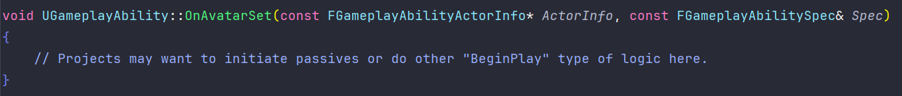
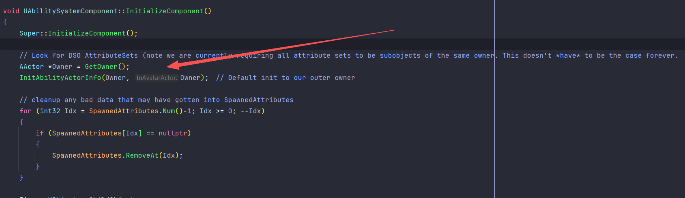
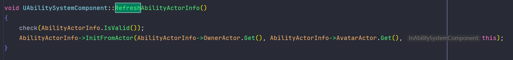
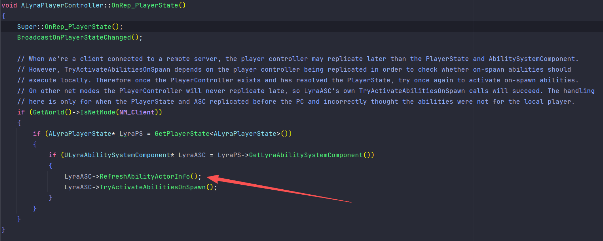
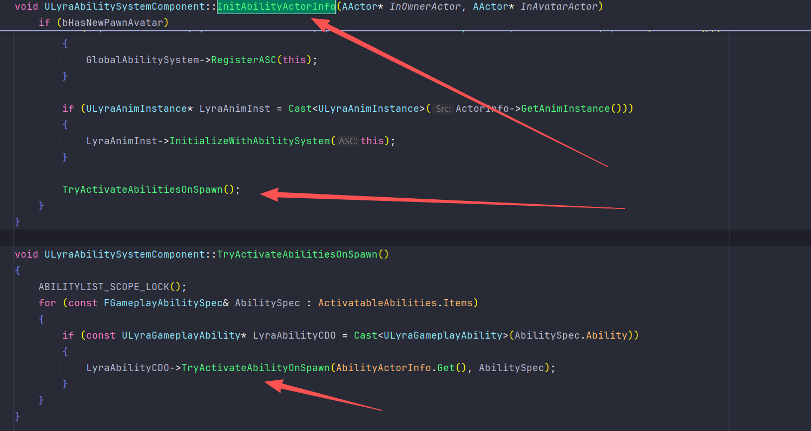
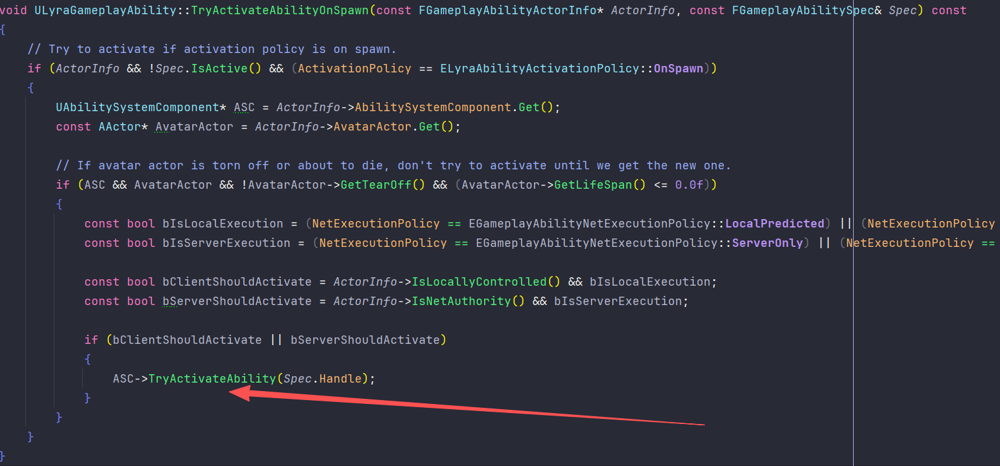
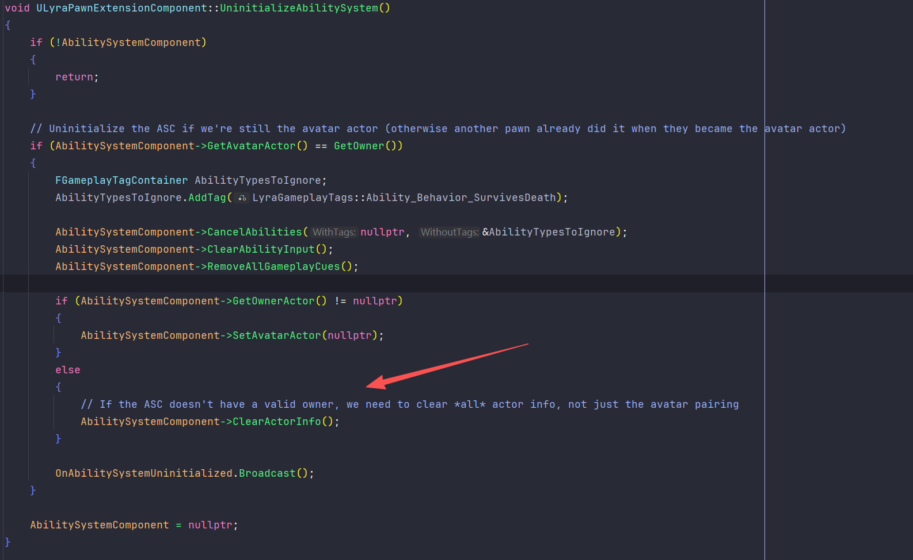

`UAbilitySystemComponent::InitAbilityActorInfo` 可以把它理解成：

**给 ASC 建立“我是谁、我控制谁、谁在控制我、我该对哪个肉身做动画/位移/目标判定”的运行时上下文。**

它是 GAS 几乎所有能力执行、预测、动画、Tag/GE 应用、输入归属判断的**地基**。

- ​`OwnerActor`：逻辑拥有者
- ​`AvatarActor`：物理表现体，通常是 Pawn / Character

这俩经常相同，但在 Lyra 里**通常不同**：

- ​`OwnerActor = PlayerState`
- ​`AvatarActor = Pawn`

**它真正初始化的核心对象是谁**

不是 ASC 自己，而是：​`AbilityActorInfo`

它是一个缓存结构，定义在 GameplayAbilityTypes.h。

里面缓存了这些关键引用：

- ​`OwnerActor`
- ​`AvatarActor`
- ​`PlayerController`
- ​`AbilitySystemComponent`
- ​`SkeletalMeshComponent`
- ​`AnimInstance`
- ​`MovementComponent`
- ​`AffectedAnimInstanceTag`

也就是说，能力运行时不必每次都去：

- 找 controller
- 找 mesh
- 找 movement component
- 找 anim instance

它都从 `CurrentActorInfo / AbilityActorInfo` 拿。

---

**引擎里** **​`InitAbilityActorInfo`​**​ **具体做了什么**

1. 检查旧状态，判断 Avatar 是否变化

```cpp
bool WasAbilityActorNull = (AbilityActorInfo->AvatarActor == nullptr);
bool AvatarChanged = (InAvatarActor != AbilityActorInfo->AvatarActor);
```

作用：

- 判断这次是不是第一次有 Avatar
- 或者是不是 Pawn/Avatar 发生了切换

这个判断后面会决定：

- 要不要补发 deferred gameplay cues
- 要不要通知所有能力 `OnAvatarSet`

---

2. 真正填充 `AbilityActorInfo`

```cpp
AbilityActorInfo->InitFromActor(InOwnerActor, InAvatarActor, this);
```

这一步又会进入 [GameplayAbilityTypes.cpp](D:/UE/UE_5.7/Engine/Plugins/Runtime/GameplayAbilities/Source/GameplayAbilities/Private/GameplayAbilityTypes.cpp:23) 的 `FGameplayAbilityActorInfo::InitFromActor`。

它做了几件非常实用的事：

2.1 保存最基础的 3 个引用

```cpp
OwnerActor = InOwnerActor;
AvatarActor = InAvatarActor;
AbilitySystemComponent = InAbilitySystemComponent;
```

2.2 沿 owner 链找 `PlayerController`

```cpp
AActor *TestActor = InOwnerActor;
while (TestActor)
{
    if (APlayerController * CastPC = Cast<APlayerController>(TestActor))
    ...
    if (APawn * Pawn = Cast<APawn>(TestActor))
    ...
    TestActor = TestActor->GetOwner();
}
```

2.3 第一次找到 PC 时回调 `OnPlayerControllerSet()`

```cpp
if (OldPC == nullptr && PlayerController.IsValid())
{
    InAbilitySystemComponent->OnPlayerControllerSet();
}
```

这给项目留了一个扩展点。Lyra 没有重点覆写它，但它是一个非常典型的“控制权刚完整建立”的时机。

2.4 从 Avatar 抓肉身组件

```cpp
SkeletalMeshComponent = AvatarActorPtr->FindComponentByClass<USkeletalMeshComponent>();
MovementComponent = AvatarActorPtr->FindComponentByClass<UMovementComponent>();
```

这一步决定了后续能力能不能方便地：

- 播 Montage
- 取 AnimInstance
- 控角色移动
- 拿角色朝向/移动状态

---

3. 把 ASC 自己的 `OwnerActor`​ / `AvatarActor` 也同步一份

```cpp
SetOwnerActor(InOwnerActor);
SetAvatarActor_Direct(InAvatarActor);
```

这里容易忽略：

- ​`AbilityActorInfo` 是一份缓存
- ASC 本体也维护 `OwnerActor`​ / `AvatarActor`

二者要保持一致，否则很多复制、RPC、外部查询会混乱。

---

4. 处理延迟的 GameplayCue

```cpp
if ((WasAbilityActorNull || PrevAvatarActor == nullptr) && InAvatarActor != nullptr)
{
    HandleDeferredGameplayCues(&ActiveGameplayEffects);
}
```

意思是：

- 有些 GE/Cue 可能已经到了
- 但之前没有有效 Avatar，Cue 无法真正落地表现
- 一旦现在有了 Avatar，就要把之前攒着的 Cue 补执行

---

5. 如果 Avatar 变了，通知所有能力 `OnAvatarSet`

```cpp
for (FGameplayAbilitySpec& Spec : ActivatableAbilities.Items)
{
    ...
    AbilityInstance->OnAvatarSet(AbilityActorInfo.Get(), Spec);
}
```

这是 `InitAbilityActorInfo` 最核心的副作用之一。

它意味着：

**所有已授予的能力，都能知道“你现在附着/操作的 Avatar 换了”。**

为什么重要？

- 被动能力可以在这里自动激活
- 跟 Pawn 绑定的缓存可以重建
- 依赖旧 Avatar 的能力可以自我结束
- 动画、摄像机、移动、武器组件引用都能在这里重新抓

而 `UGameplayAbility::OnAvatarSet` 默认是个空实现，看 GameplayAbility.cpp：

- 引擎明确写了：项目可以在这里启动 passive / begin-play 式逻辑

---

6. 注册 GameplayTagResponseTable

```cpp
TagTable->RegisterResponseForEvents(this);
```

如果你用了全局 Tag Response Table，这一步会把 ASC 接到对应的 tag 反应逻辑上。

(关于GameplayTagResponseTable的讲解见附录1)

---

7. 重置 Montage 相关状态

```cpp
LocalAnimMontageInfo = FGameplayAbilityLocalAnimMontage();
if (IsOwnerActorAuthoritative())
{
    SetRepAnimMontageInfo(FGameplayAbilityRepAnimMontage());
}
if (bPendingMontageRep)
{
    OnRep_ReplicatedAnimMontage();
}
```

这说明 `InitAbilityActorInfo` 不只是“能力逻辑初始化”，它还会处理：

- 本地 Montage 状态
- 复制来的 Montage 状态
- Avatar 切换后的动画同步恢复

所以如果 ActorInfo 没初始化好，Montage 同步和 Ability Animation 往往会跟着出问题。

(关于这段代码的讲解, 见附录2)

---

**它和** **​`OnGiveAbility`​**​  **/**  **​`OnAvatarSet`​**​ **的关系**

这块特别重要。

在 GameplayAbility.cpp：

```cpp
void UGameplayAbility::OnGiveAbility(...)
{
    SetCurrentActorInfo(Spec.Handle, ActorInfo);

    if (ActorInfo && ActorInfo->AvatarActor.IsValid())
    {
        OnAvatarSet(ActorInfo, Spec);
    }
}
```

意思是：

- 能力被授予时，会先拿到当前 ActorInfo
- 如果此时 Avatar 已经有效，`OnGiveAbility`​ 会立刻转调 `OnAvatarSet`

所以有两种常见时序：

情况 A：先有 ActorInfo，再 GiveAbility

- ​`OnGiveAbility`
- 紧接着 `OnAvatarSet`

情况 B：先 GiveAbility，后面 Avatar 才到

- ​`OnGiveAbility` 先发生
- 之后某次 `InitAbilityActorInfo`​ 检测到 Avatar 变化, 统一调用所有能力的 `OnAvatarSet`

这就是为什么 `InitAbilityActorInfo` 是“补全运行时能力上下文”的关键点。



---

ASC 在 `InitializeComponent()` 里就会默认调用:

```cpp
InitAbilityActorInfo(Owner, Owner);
```



意思是：

- 组件初始化时，先假设 `OwnerActor = AvatarActor = 外层 Owner`
- 这是一个“默认保底初始化”

这样好处是：

- 很多单体 Actor 场景够用了
- AttributeSet、基本 Ability 上下文能先建立起来

但对 Lyra 这种 `PlayerState + Pawn`​ 分离模型来说，这只是**临时值**，后面必须再用真正的 `(PlayerState, Pawn)` 重绑一次。

---

​**​`RefreshAbilityActorInfo`​**​ **和** **​`ClearActorInfo`​**​ **的区别**



它的意思是：

- ​`OwnerActor`​ / `AvatarActor` 不变
- 但重新抓一遍：

  - PlayerController
  - MovementComponent
  - SkeletalMesh
  - AnimInstance 等缓存

适合场景：

- Controller 刚复制到客户端
- Pawn 控制权变化
- AnimInstance / movement / mesh 状态变了

Lyra 在 LyraPlayerController.cpp 就这么干：



- ​`PlayerState` 后到时，刷新 ActorInfo
- 再尝试激活 `OnSpawn` abilities

注释翻译:

> // 当我们作为客户端连接到远程服务器时，玩家控制器（PlayerController）的网络复制可能会晚于玩家状态（PlayerState）和技能系统组件（AbilitySystemComponent）。  
> // 然而，"出生时尝试激活技能"（TryActivateAbilitiesOnSpawn）函数依赖于玩家控制器已完成复制，才能检查出生时自动激活的技能是否应当在本地执行。因此，一旦玩家控制器存在且已成功关联到玩家状态，就再次尝试激活出生时自动激活的技能。  
> // 在其他网络模式下，玩家控制器永远不会出现延迟复制的情况，因此Lyra技能系统组件自身的TryActivateAbilitiesOnSpawn调用会成功执行。这里的处理逻辑仅用于处理"玩家状态和技能系统组件先于玩家控制器完成复制，导致系统错误地认为这些技能不属于本地玩家"的特殊情况。

关于`TryActivateAbilityOnSpawn`:

这个函数是Lyra自己定义的辅助函数, 作用是"当新的Avatar生成时, 激活所有想激活的GA".





---

​`ClearActorInfo()`

它会清掉：

- ​`OwnerActor`
- ​`AvatarActor`
- ​`PlayerController`
- Mesh/Movement 等缓存

适合场景：

- 角色死了/被移除
- Avatar 不再有效
- 切图/拆离/彻底解绑

Lyra 在 LyraPawnExtensionComponent.cpp 里就区分了：

- 有 owner 但 avatar 失效：`SetAvatarActor(nullptr)`
- 连 owner 都没了：`ClearActorInfo()`



---

**在 Lyra 里它多做了什么**

Lyra重写了这个函数, 调用了`Super::InitAbilityActorInfo(...)`之后, 它又加了几层项目语义：

1. 如果是新的 Pawn Avatar，通知所有 Lyra ability

```cpp
LyraAbilityInstance->OnPawnAvatarSet();
```

这是 Lyra 自己额外定义的 Pawn 层事件，比原生 `OnAvatarSet` 更贴近项目语义。

2. 注册到全局 AbilitySystem

```cpp
GlobalAbilitySystem->RegisterASC(this);
```

只有真正拿到 Pawn Avatar 后才注册，因为全局效果可能需要 Avatar。

3. 把动画实例和 ASC 绑定

```cpp
LyraAnimInst->InitializeWithAbilitySystem(this);
```

这样动画层能直接读能力 Tag/状态。

4. 尝试激活 `OnSpawn` abilities

```cpp
TryActivateAbilitiesOnSpawn();
```

所以在 Lyra 里，`InitAbilityActorInfo` 还承担了：

- Pawn ready
- 动画 ready
- 被动能力 ready
- 全局系统接入

---

**它为什么对预测尤其关键**

很多能力逻辑会依赖 `ActorInfo` 里的这些判断：

- ​`IsLocallyControlled()`
- ​`IsLocallyControlledPlayer()`
- ​`IsNetAuthority()`
- ​`PlayerController`
- ​`AvatarActor`
- ​`MovementComponent`

比如本地预测能力能不能本地先执行，常常就看这些值。  
如果 `InitAbilityActorInfo` 没调用对、调用晚了、或者 owner/avatar 配错了，会出现：

- 本地预测不起作用
- ​`OnSpawn` 被动能力客户端不激活
- ability task 找不到 avatar
- montage 不播
- movement 操作无效
- ​`GetControllerFromActorInfo()`​ / `GetAnimInstance()` 返回空
- 远端/本地控制判断错乱

---

# 附录1: GameplayTagResponseTable

GameplayTagResponseTable 本质上是一个：

 **“标签计数 -> 自动施加/更新/移除某些 GameplayEffect” 的全局规则表。**

它的用途就是：

- 当某些 Tag 的计数变化时
- 自动算出一个“净计数”
- 然后自动给 ASC 挂上某些响应用 GE

它是一个 `UDataAsset`，类型名叫：

核心数据是：

```cpp
TArray<FGameplayTagResponseTableEntry> Entries;
```

每个 `Entry` 里有两组对立关系

- ​`Positive`
- ​`Negative`

每组里又有：

- 一个 `Tag`
- 一组 `ResponseGameplayEffects`
- 一个 `SoftCountCap`

**它的工作模型**

你可以把一条规则理解成：

- ​`Positive.Tag` 贡献正分
- ​`Negative.Tag` 贡献负分
- 最后算 `TotalCount = PositiveCount - NegativeCount`

然后：

- ​`TotalCount > 0`​：应用/更新 `Positive.ResponseGameplayEffects`
- ​`TotalCount < 0`​：应用/更新 `Negative.ResponseGameplayEffects`
- ​`TotalCount == 0`：两边都移除

核心代码是：

```cpp
int32 Positive = GetCount(Entry.Positive, ASC);
int32 Negative = GetCount(Entry.Negative, ASC);
TotalCount = Positive - Negative;
```

然后根据正负决定加哪边的 GE。

**一个具体例子**

假设你做这样一条表：

- ​`Positive.Tag = Status.Haste`
- ​`Positive.ResponseGameplayEffects = [GE_Response_Haste]`
- ​`Negative.Tag = Status.Slow`
- ​`Negative.ResponseGameplayEffects = [GE_Response_Slow]`

结果会是：

- 身上 2 层 `Haste`​，0 层 `Slow`

  - ​`TotalCount = 2`
  - 自动给你应用 `GE_Response_Haste`
  - 并把这个 GE 的 level 设成 2
- 身上 1 层 `Haste`​，3 层 `Slow`

  - ​`TotalCount = -2`
  - 自动移除正向 GE
  - 自动应用 `GE_Response_Slow`
  - level = -2
- 两边抵消到 0

  - 响应 GE 全部移除

**它是怎么接到 ASC 上的**

前面那句：

```cpp
TagTable->RegisterResponseForEvents(this);
```

它的意思是：

- 当前 ASC 初始化 ActorInfo 时
- 如果全局配置了 `GameplayTagResponseTable`
- 就把自己注册进去

而注册时干的事，是为表里的每条规则都监听对应 Tag 的变化事件

```cpp
ASC->RegisterGameplayTagEvent(Entry.Positive.Tag, EGameplayTagEventType::AnyCountChange)
ASC->RegisterGameplayTagEvent(Entry.Negative.Tag, EGameplayTagEventType::AnyCountChange)
```

也就是：

一旦这些 Tag 的 count 变化，就回调 `TagResponseEvent` 重新结算。

​**​`SoftCountCap`​**​ **是干嘛的**

定义在 GameplayTagResponseTable.h：

```cpp
/** The max "count" this response can achieve */
int32 SoftCountCap = 0;
```

意思是：

- 真实层数可以更高
- 但用于响应计算时，最多按这个上限算
- ​`0` 表示不封顶

例子：

- 你有 10 层 `Status.Haste`
- ​`SoftCountCap = 3`
- 那响应 GE 最多按 3 级算

---

**它是“全局表”**

这个表不是每个 ASC 单独配置的，而是从 `AbilitySystemGlobals` 全局拿。

加载位置在 AbilitySystemGlobals.cpp：

```cpp
GameplayTagResponseTable = LoadObject<UGameplayTagReponseTable>(..., DeveloperSettings->GameplayTagResponseTableName ...)
```

也就是说它通常在项目设置里配：

- ​`GameplayAbilitiesDeveloperSettings`
- ​`GameplayTagResponseTableName`

---

**Lyra 里有没有真用它**

你当前这个 Lyra 项目里没有启用。  
配置在 DefaultGame.ini：

```ini
GameplayTagResponseTableName=None
```

这也说明，Lyra 更偏向：

- Ability
- GameplayEffect
- AttributeSet
- TagRelationshipMapping
- GameplayEvent

来组织逻辑，而不是靠 `GameplayTagResponseTable` 做大部分状态联动。

---

**它适合什么场景**

适合：

- 数据驱动的状态联动
- “Tag 层数 -> 自动 Buff/Debuff”
- 不想每次都写 Ability / Execution / 自定义监听代码

不太适合：

- 复杂时序逻辑
- 带大量条件判断的战斗规则
- 需要明确来源、目标、上下文的复杂效果链

因为它本质很机械：

- 监听 tag count
- 算净值
- 自动挂 GE

# 附录2: Montage同步

这段逻辑，可以理解成“**ASC 重新绑定动画宿主(Avatar)时，对 Montage 状态做清理、续接和纠偏**”

**先建立一个模型**  
GAS 里跟 Ability 动画相关，实际上有两层状态：

- ​`AbilityActorInfo`​：决定 ASC 现在该操作谁的 `AnimInstance`、谁的 Pawn、谁的 Controller。
- ​`LocalAnimMontageInfo`：本地运行态，记录“当前本地认为在播什么 montage”。
- ​`RepAnimMontageInfo`：复制态，记录“服务器要发给别人的 montage 快照”。

这两层不是一回事：

- ​`LocalAnimMontageInfo` 是“我本地现在在播什么”。
- ​`RepAnimMontageInfo` 是“网络上同步出去的 montage 快照”。

**完整链路是什么**  
Montage 的同步链路大致是这样：

1. Ability 播动画时，ASC 会进 `PlayMontageInternal`​，先从 `AbilityActorInfo->GetAnimInstance()` 找当前要操作的动画实例。
2. 播放成功后，会写 `LocalAnimMontageInfo`​，包括当前 montage、驱动它的 ability、`PlayInstanceId`。
3. 如果是服务器，就把当前 montage 的复制快照写进 `RepAnimMontageInfo`，并在后续 tick 里持续更新位置、速率、section、是否停止等。
4. 客户端收到 `RepAnimMontageInfo`​ 后，会进 `OnRep_ReplicatedAnimMontage()`。
5. 如果当前还没有可用的 `AnimInstance`​，或者子类判定“现在还不适合吃这份复制数据”，它不会硬播，而是 `bPendingMontageRep = true`，先挂起。
6. 等条件成熟后，再重新执行 `OnRep_ReplicatedAnimMontage()`，把 montage 补播出来，并校正：

   - 播放速率
   - 停止状态
   - 当前 section / next section
   - 播放位置误差

这里的 `PlayInstanceId` 很重要。它是“第几次播放这段 montage”，即使是同一个 montage 资源，重复播放也能区分，不然客户端可能以为“还是同一段，不需要重播”。

**这三句，分别在干什么**

```cpp
LocalAnimMontageInfo = FGameplayAbilityLocalAnimMontage();
if (IsOwnerActorAuthoritative())
{
    SetRepAnimMontageInfo(FGameplayAbilityRepAnimMontage());
}
if (bPendingMontageRep)
{
    OnRep_ReplicatedAnimMontage();
}
```

第一句清 `LocalAnimMontageInfo`，意思是：

- 旧 Avatar 上的 montage 引用不要再信了。
- 旧 `AnimatingAbility` 绑定关系不要再信了。
- 旧 `PlayInstanceId` 也不要沿用。

因为 `InitAbilityActorInfo()`​ 的核心场景之一就是：**ASC 重新绑定了 Avatar / AnimInstance**。这时候旧 Pawn 上的 montage 状态，对新 Pawn 往往已经是脏数据。

第二句只在权威端清 `RepAnimMontageInfo`，意思是：

- 服务器不要继续拿“旧 Avatar 的 montage 快照”往外同步。
- 默认构造的 `FGameplayAbilityRepAnimMontage`​ 里 `IsStopped=true`，等于把“当前没有有效 montage 在播”这个状态重新立住。
- 这还会影响 ASC 是否继续为了 montage 复制而 tick，相关判断在 AbilitySystemComponent_Abilities.cpp:202。

第三句是最关键的“恢复动作”：

- 如果之前复制包已经到了，但当时 `AnimInstance` 还没好，所以只能挂起；
- 现在 `ActorInfo`​ 刚初始化完，ASC 已经知道该接到哪个 Avatar / 哪个 `AnimInstance` 上了；
- 那就立刻再跑一次 `OnRep_ReplicatedAnimMontage()`，把那份之前没吃掉的 montage 复制数据补上。

所以 `bPendingMontageRep`​ 本质上就是一个“**延迟消费复制 Montage 数据**”的开关。

**为什么这跟 Avatar 切换关系这么大**  
因为 montage 不是抽象逻辑，它最终一定要落到某个 `AnimInstance` 上。

如果 ASC 之前挂在旧 Pawn 上，现在 Avatar 换成新 Pawn，但你还拿着旧的 `LocalAnimMontageInfo`：

- 位置校正会对错对象做
- section 跳转会对错对象做
- stop / blend out 会对错对象做
- 预测失败时，`OnPredictiveMontageRejected()`​ 也可能停不到正确的 montage，见 [AbilitySystemComponent_Abilities.cpp](D:/UE/UE_5.7/Engine/Plugins/Runtime/GameplayAbilities/Source/GameplayAbilities/Private/AbilitySystemComponent_Abilities.cpp:3222)

所以这里先清本地状态，再尝试把复制态重新接到新 Avatar 上，是非常合理的。

一个很重要的补充是：

- ​`InitAbilityActorInfo()` 是“重建关系 + montage reset/replay”的重操作。
- ​`RefreshAbilityActorInfo()`​ 只是轻量刷新 `ActorInfo` 缓存。
- 所以 `InitAbilityActorInfo()` 不是一个“随便反复调用也没事”的无害刷新函数。

一句话总结：

**这段代码是在把 ASC 从旧动画宿主的 Montage 状态里安全地抽出来，再把“当前应该同步的 Montage 状态”接到新的 Avatar/AnimInstance 上。**

‍
