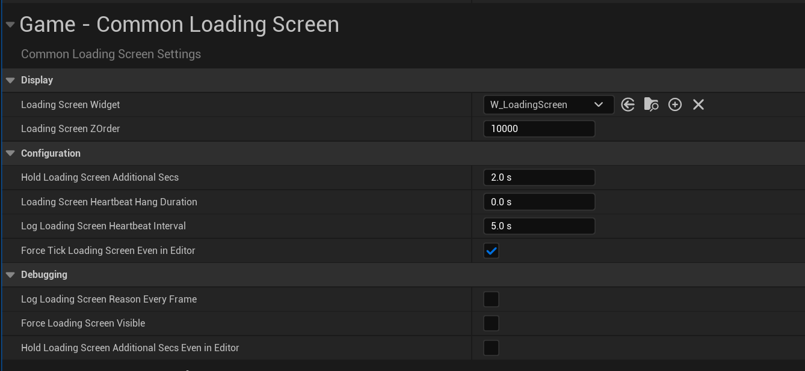

# CommonLoadingScreen插件介绍

该插件的主要思路是用一个Manager(继承于GameInstanceSubsystem), 每一帧都检测是否需要显示加载界面.

创建一个ILoadingProcessInterface接口, 需要显示LoadinScreen的类就要继承这个接口类, 然后覆盖其**ShouldShowLoadingScreen**函数.

检查的流程在Manager中, 具体为:

- 查看是否设置了强制显示加载界面
- 由于Manager继承于GameInstanceSubsystem, 所以其存在时GameInstance肯定也存在.  
  因此只检查WorldContext, World, GameState是否存在.
- 是否正在加载地图(比如传送到另一个Level)
- 检查GameState是否要求加载, 其组件是否要求加载.
- 检查LocalPlayers的PlayerController是否要求加载, 其组件是否要求加载.
- 检查是否有外部主动请求显示Loading界面.

该插件实现了LoadingProcessTask类, 通过暴露一个Static接口, 让其他类可以自由调用该接口以显示加载界面.

此外, ShouldShowLoadingScreen函数额外要求输出Reason, 用于表示该次显示加载界面的原因, 这个参数大大方便了Debug.

```cpp
//检查该Object是否实现了ILoadingProcessInterface接口, 如果实现了, 判断当前是否应该显示Loading界面
static UE_API bool ShouldShowLoadingScreen(UObject* TestObject, FString& OutReason);

virtual bool ShouldShowLoadingScreen(FString& OutReason) const
{
	return false;
}
```

该插件在项目设置中定义了多个参数可以调整, 比如要显示的加载界面的UI, 是否强制显示等.



‍
