# Lyra(一) 地图切换 & Experience加载 & Loading界面

推荐先了解一下GameFeature, AssetManager的概念

本文主要梳理一下PIE中, 人物走到传送点, 传送到新level的过程, 以及中间的loading界面.

推荐的阅读方法是电脑上打开Lyra项目, 边摸索项目边看文章, 而非直接对着文章干看.

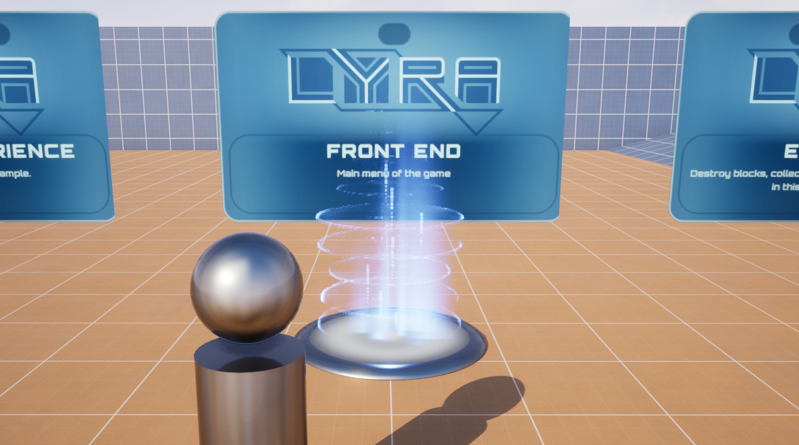

# 切入

传送点是B_TeleportToUserFacingExperience. 

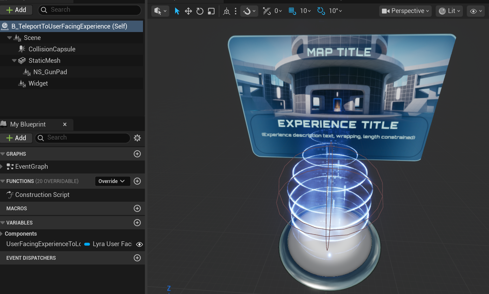

那显然就是这个胶囊体的Overlap事件触发传送. 进事件图表看一眼, 发现Overlap事件触发了LoadIntoExperience事件. 

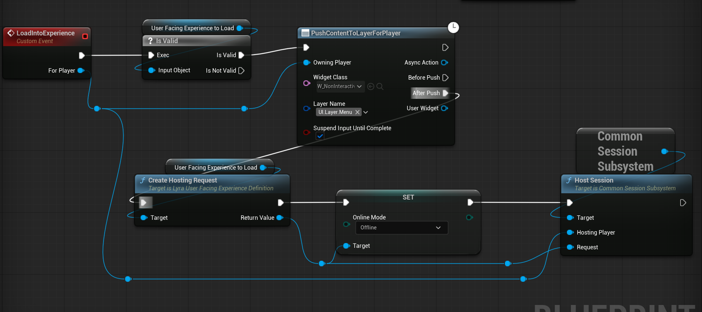

> PushContentToLayerForPlayer这个节点是用来显示UI的, 这里是显示了一个灰暗的表示正在加载的UI, 可以暂时略过

UserFacingExperienceToLoad是一个LyraUserFacingExperienceDefinition类型的变量. 它的初始化是在B_ExperienceList3D的事件图表中, 由于LyraUserFacingExperienceDefinition是个PrimaryAsset, 所以可以通过AssetManager的GetPrimaryAssetIdList方法查找所有LyraUserFacingExperienceDefinition, 放到一个数组里面. 查找完毕后为数组的每个元素计算位置并执行SpawnActor, 就在场景中生成了我们上面提到的传送点B_TeleportToUserFacingExperience.

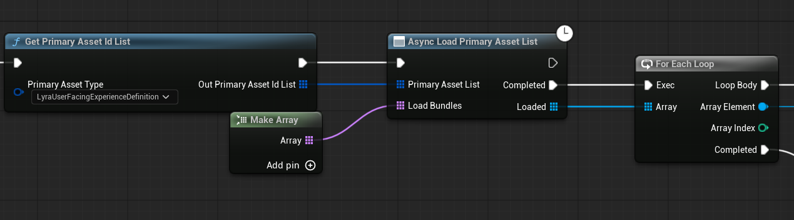

所以总体流程是: 点击PIE按钮进入游戏, B_ExperienceList3D被放置在场景中, 其BeginPlay事件为所有**LyraUserFacingExperienceDefinition**各生成了一个传送点B_TeleportToUserFacingExperience, 这个传送点的Overlap事件触发后会根据**LyraUserFacingExperienceDefinition**中的信息来加载新地图. 那么这个LyraUserFacingExperienceDefinition的数据结构就是我们重点关注的东西.

---

# LyraUserFacingExperienceDefinition和LyraExperienceDefinition

打开文件管理中的PluginContent选项, 就可以看到Lyra中大部分LyraUserFacingExperienceDefinition的配置.

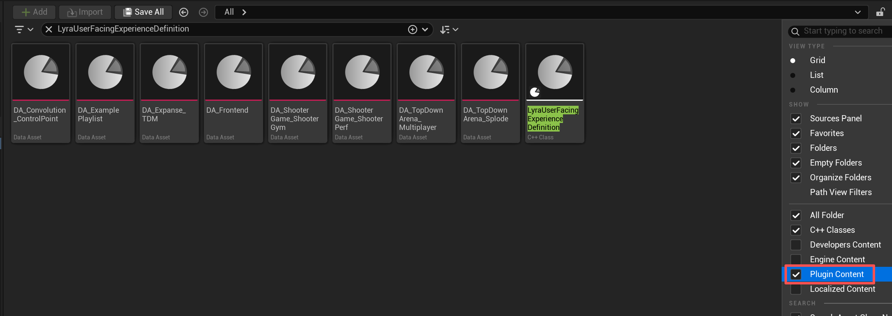

打开其中一个DataAsset, 就大概知道这玩意在配置什么. 大致是: 对应的Level, 对应的LyraExperienceDefinition, 最大可游玩人数, 一些UI相关的配置, 以及一些额外的比较杂的配置. 

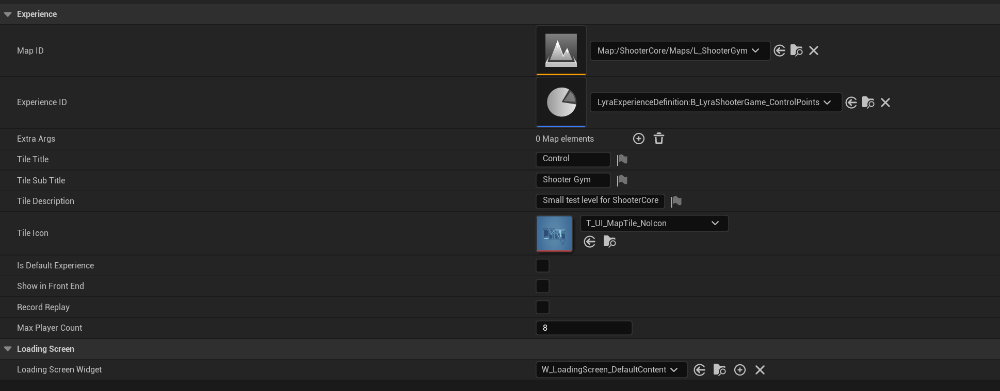

Level就不多说了, 这**LyraExperienceDefinition**是个什么, 看看:

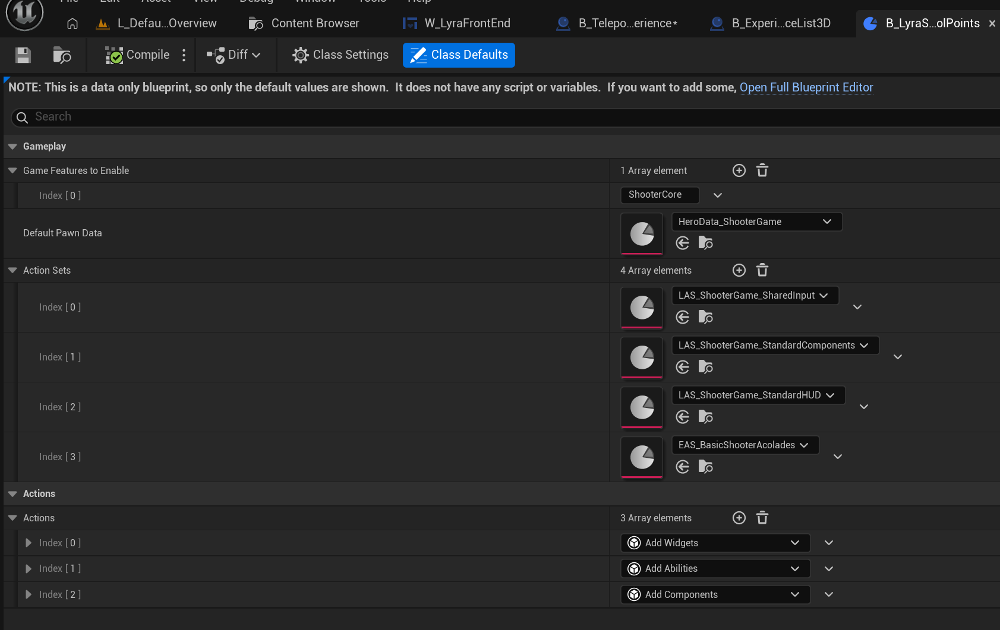

所以主要是配置这个experience加载时想启用的GameFeatures, 想使用的PawnData, 以及想用的Actions. 中间还多了个新概念ActionSets, 简称LAS(LyraExperienceActionSet).

> 可以看到Index[3]对应的资产简写为EAS而非LAS, 感觉是命名没规范好0.0

GameFeatures和Actions就是GameFeature那套东西, 这里不多说了.

PawnData可以看一下, 就是配置GAS那套东西, 以及一些常用的输入配置, 第三人称等等.

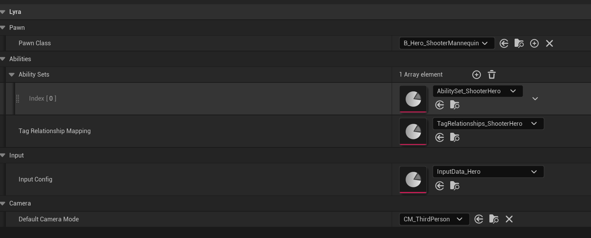

而ActionSet其实也并非新鲜的东西, 其中依旧是GameFeatures和Actions的配置.

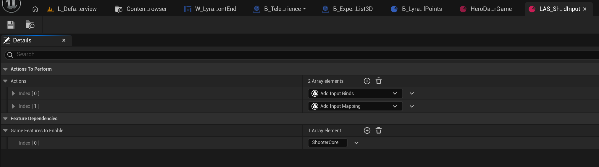

那额外在LAS中配置这些东西作用是什么? 为啥不直接在LyraExperienceDefinition中的GameFeatures和Actions中配置? [UE5 Lyra项目GameplayExperience拆解 - 花游倩的文章 - 知乎](https://zhuanlan.zhihu.com/p/602889979)此文中提到LAS是为了将不同LyraExperienceDefinition中共同想启用的GameFeatures和Actions抽离出来, 从而能够像插件一样方便地配置给各个Experience. 这样看来这一步的抽象确实节省了一些繁琐的工作.

那LyraExperienceDefinition看完了, 回到前面的Overlap事件中, 显然加载Experience的逻辑是放在CreateHostingRequest和HostSession了.

# Host & URL & ServerTravel

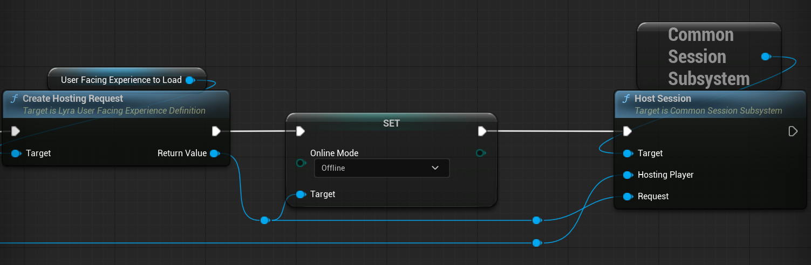

看一下CreateHostingResult的实现:

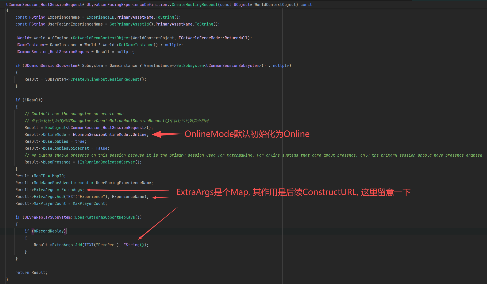

可以看到, 我们前面配置好的LyraUserFacingExperienceDefinition在此时派上用场了, 创建Request需要配置玩家人数, ExtraArgs, MapID等等.

在CreateHostingRequest中, Request的OnlineMode值初始化为Online, 而事件图表则将返回值的OnlineMode改为了Offline.

HostSession:

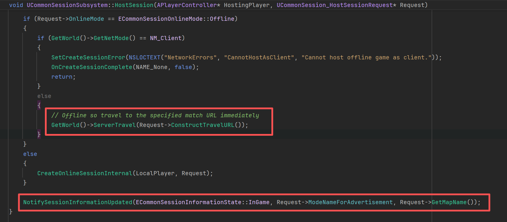

由于我们将Request的OnlineMode改为Offline, 直接就走的ServerTravel函数. ServerTravel需要传入一个URL, 这里利用ConstructTravelURL构建.

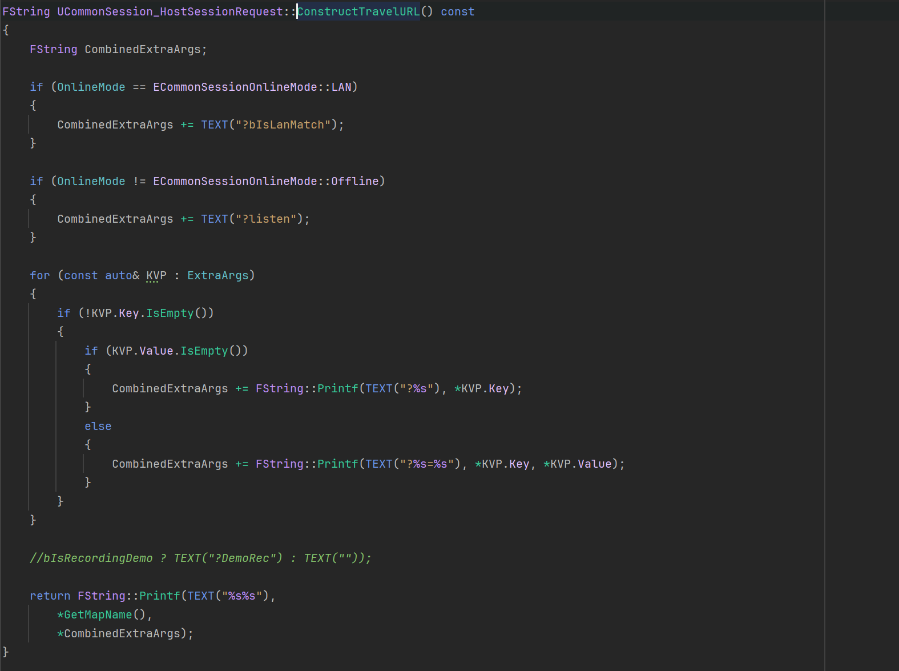

可以看到, 最主要的就是将ExtraArgs这个Map中的每个元素加入结果字符串, 并且在最后返回的时候再加上MapName. 这个MapName实际上就是利用Request中的MapId, 通过AssetManager拿到的.

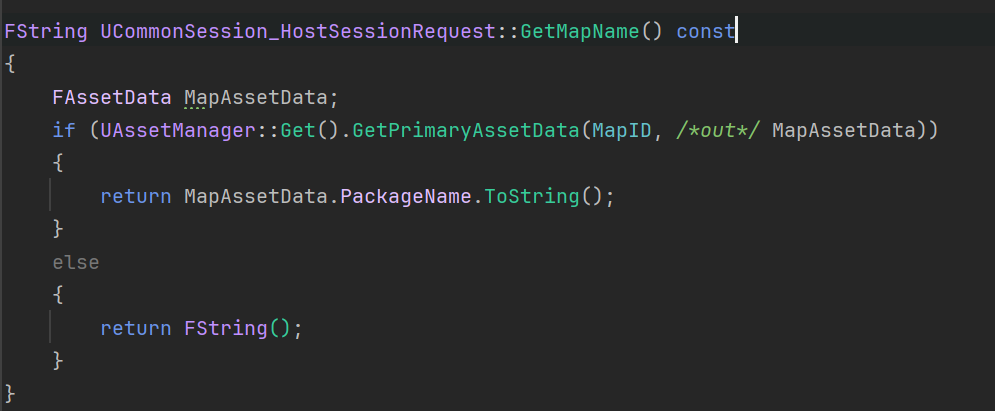

所以, 每个Request得到的URL格式实际上是(用问号分割): <u>MapName</u>?Experience=<u>xxx</u>?DemoRec. 这个URL实际上很关键, 地图切换加载什么的都跟他有关系, 贯穿始终.

> 以最左边的Experience为例，URL为L"/ShooterMaps/Maps/L_Convolution_Blockout?Experience=B_LyraShooterGame_ControlPoints?DemoRec"。这代表了三个有效参数：
>
> MapName：/ShooterMaps/Maps/L_Convolution_Blockout。  
> Experience Id：Experience=B_LyraShooterGame_ControlPoints。  
> bReplay：DemoRec。
>
> (以上引用自[UE5 Lyra项目学习（一） 地图加载流程 - Cherry的文章 - 知乎](https://zhuanlan.zhihu.com/p/563434530))

关于UWorld::ServerTravel: [虚幻引擎中的关卡切换 | 虚幻引擎 5.7 文档 | Epic Developer Community](https://dev.epicgames.com/documentation/zh-cn/unreal-engine/travelling-in-multiplayer-in-unreal-engine)

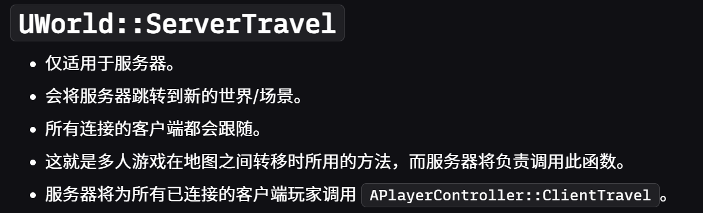

由于是Offline状态, 我们可以将自己当作服务器来写, 所以直接调用ServerTravel. 关于这个函数的分析就先略过了, 好像也很少有文章详细分析它, 以后有机会学习时再写文章吧. 此处先理解为ServerTravel会根据传入的URL来请求切换地图.

至于NotifySessionInformationUpdated函数, 会广播cpp和蓝图的委托. 这里可以看下监听这个委托的其中一个回调函数OnNotifySessionInformationChanged. 做的事情基本上是更新信息.

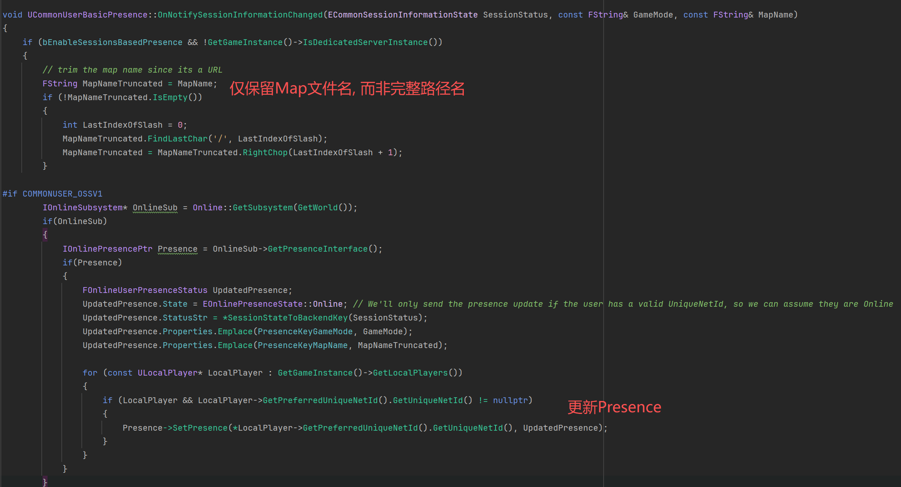

---

# Experience加载

> 下一帧引擎会检测我们之前的地图加载请求。堆栈直到ALyraGameMode::InitGame
>
> 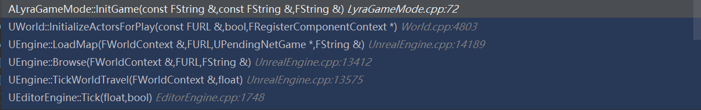
>
> (以上引用自[UE5 Lyra项目学习（一） 地图加载流程 - Cherry的文章 - 知乎](https://zhuanlan.zhihu.com/p/563434530))

InitGame中, 按注释的说法是先在当前帧初始化startup settings, 所以会在下一帧才执行HandleMatchAssignmentIfNotExpectingOne.

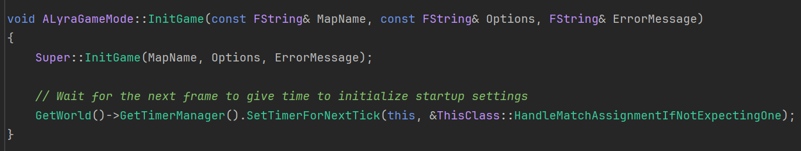

而HandleMatchAssignmentIfNotExpectingOne简单来说就是从Options字符串(实际上就是一路传下来的前面的URL)中拿到ExperienceId, 如果没拿到就认为ExperienceId是默认id. 这个默认id可能从设置, 命令行等地方拿到, 如果都拿不到, 那么代码里面写死了默认为我们开头的那个场景所对应的Experience的id.

拿到ExperienceId之后, 传给OnMatchAssignmentGiven. 这个函数通过Manager的SetCurrentExperience更新当前Experience

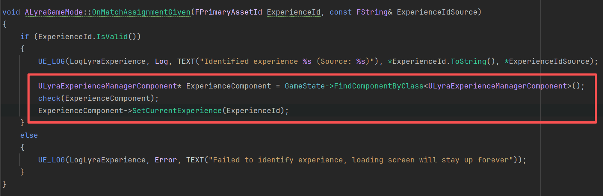

SetCurrentExperience通过AssetManager根据Id拿到LyraExperienceDefinition, 这个的数据结构我们前面提到过.

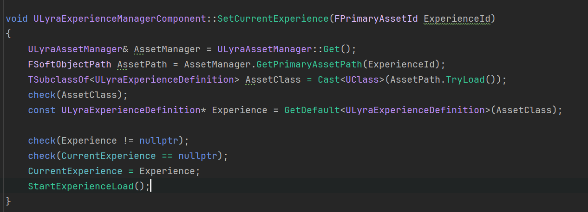

这里用CurrentExperience = Experience, 其一是方便各函数直接使用, 其二则是因为这个CurrentExperience是个Replicated变量, 由于客户端是拿不到GameMode的, 所以上面从Init开始的代码都是服务器在执行, 到了这里将Experience赋给CurrentExperience, 就能够在OnRep函数中也一起调用StartExperienceLoad函数, 从而一起进行Experience加载.

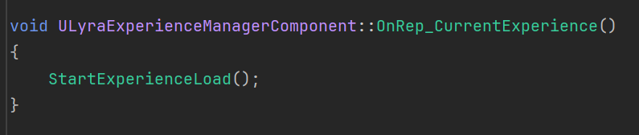

之后就是具体的加载Experience的流程. 简单来说分为三个阶段, StartExperienceLoad(加载PrimaryAsset), OnExperienceLoadComplete(加载GameFeatures), OnExperienceFullLoadCompleted(Actions).

---

(下面是详细版, 没有兴趣可跳过, 已用分割线分割)

StartExperienceLoad的主要目的是加载LyraExperienceDefinition的大部分PrimaryAsset(比如配置好的那些LAS, 都属于PrimaryAsset).

这里描述一下StartExperienceLoad做的事情: 首先将LoadState置为ELyraExperienceLoadState::Loading, 然后创建PrimaryAssetId数组BundleAssetList, 创建FSoftObjectPath数组RawAssetList, 利用AssetManager的方法加载他们并拿到他们的Handle, 之后将两个Handle合并为一个Handle, 最后监听该Handle的"加载完成事件", 加载完成时调用回调函数OnExperienceLoadComplete.

> 值得注意的是, BundleAssetList只添加了LyraExperienceDefinition自己的PrimaryAssetId, 以及ActionSets中的所有PrimaryAssetId, 并没有添加DefaultPawnData中引用的PrimaryAssetId, 也就是说StartExperienceLoad不负责加载这部分资源. 搜索发现是在ALyraPlayerState::OnExperienceLoaded中执行的ALyraPlayerState::SetPawnData完成加载的. 而ALyraPlayerState::OnExperienceLoaded是在ALyraPlayerState::PostInitializeComponents函数中才通过CallOrRegister_OnExperienceLoaded绑定到Experience加载完成事件. 因此我认为原因应该是DefaultPawnData需要等待PlayerState加载好以后才能开始加载.
>
> 另外, RawAssetList虽然代码有涉及, 但实际上并没有对其添加任何元素. 可能是留待后续的开发.

OnExperienceLoadComplete的主要目的是加载LyraExperienceDefinition以及LAS中配置好的GameFeatures.

这里描述一下OnExperienceLoadComplete做的事情: 首先检查LoadState==ELyraExperienceLoadState::Loading, 然后利用UGameFeaturesSubsystem::GetPluginURLByName获取LyraExperienceDefinition以及LAS中配置好的GameFeatures的URL, 将LoadState置为ELyraExperienceLoadState::LoadingGameFeatures并将这些URL传入UGameFeaturesSubsystem::LoadAndActivateGameFeaturePlugin, 该函数的第二个参数可以传入一个委托, 我们传入一个绑定好回调函数的委托. 每当有一个GameFeature被Activate, 这个委托就会被触发, 执行我们的回调函数OnGameFeaturePluginLoadComplete. 当所有GameFeatures都完成加载, 执行OnExperienceFullLoadCompleted.

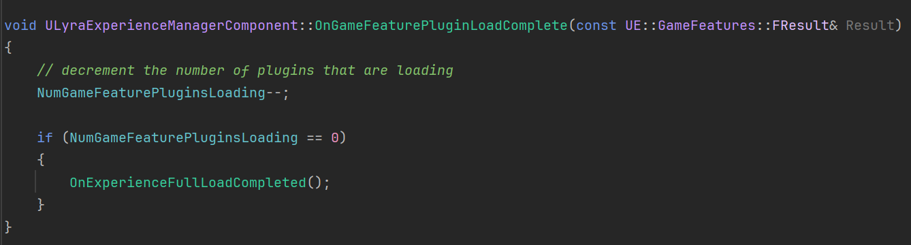

OnExperienceFullLoadCompleted的主要目的是执行LyraExperienceDefinition以及LAS中配置好的Actions.

这里描述一下OnExperienceFullLoadCompleted做的事情: 首先检查LoadState!=ELyraExperienceLoadState::Loaded(按理来说此时会是Loading或者LoadingGameFeatures), 然后将LoadState置为ExecutingActions, 之后激活LyraExperienceDefinition以及LAS中配置好的Actions. 最后将LoadState置为ELyraExperienceLoadState::Loaded.

---

在OnExperienceFullLoadCompleted的结尾, LoadState置为ELyraExperienceLoadState::Loaded之后, 广播了三个委托.

```cpp
OnExperienceLoaded_HighPriority.Broadcast(CurrentExperience)
OnExperienceLoaded_HighPriority.Clear();
OnExperienceLoaded.Broadcast(CurrentExperience);
OnExperienceLoaded.Clear();
OnExperienceLoaded_LowPriority.Broadcast(CurrentExperience);
OnExperienceLoaded_LowPriority.Clear();
```

他们用于通知其他对象完成他们自己的行为. 比方说ALyraPlayerState会注册一个回调函数到OnExperienceLoaded委托上, 这个回调函数的作用是加载DefaultPawnData; 再比方说ULyraFrontendStateComponent会在BeginPlay中注册一个回调函数到OnExperienceLoaded_HighPriority委托上, 这个回调函数的作用是尝试显示主菜单.

至此, Experience加载算是完毕了. 地图切换也基本完成了.

---

# Loading界面

前面几乎没有提到Loading界面. 实际上, Loading界面是否显示是统一在ULoadingScreenManager中管理的. 它继承了FTickableGameObject, 拥有自己的Tick函数, 函数中会利用ULoadingScreenManager::CheckForAnyNeedToShowLoadingScreen函数判断是否显示Loading界面.

具体来说, 会先检查当前是否在某些指定的状态, 或者World, GameState等是否为nullptr. 如果都没问题, 那么会检查GameState是否需要Loading, 再检查GameState的Component是否需要Loading, 然后检查ExternalLoadingProcessors, 然后检查GameInstance下的所有LocalPlayerController是否需要Loading, 以及每个LocalPlayerController的组件是否需要Loading等等等等. 还有很多细节上的东西, 感兴趣可以去看源码.

并且这个Loading界面可以在项目设置中配置, 可以指定要显示的Widget, 要显示多少秒, 以及是否在editor下也强制显示这么久, 等等.

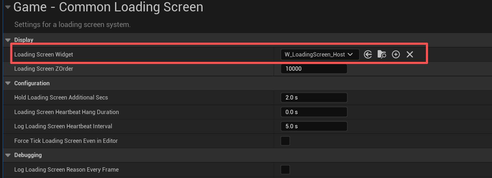

Lyra用了一个类来实现自定义此设置项: 

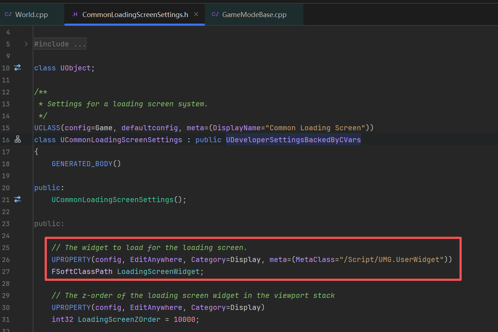

用法:

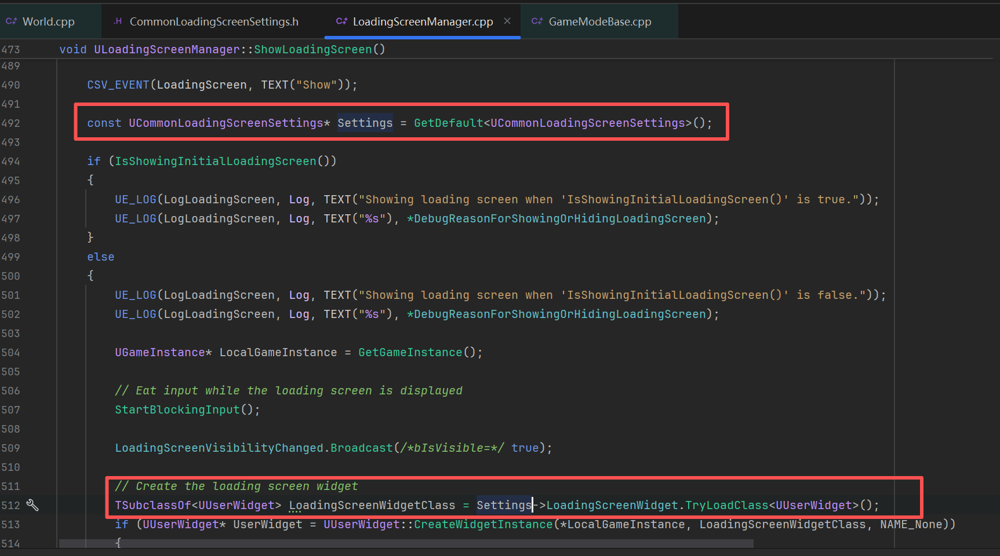

---

# 待续

主菜单界面会单独放在下一篇文章讲.

很久没写文章了, 或者该说很久没有沉下心学东西了. 实习浪费了很多时间, UE入门看视频看文档也浪费了挺多时间, 应付作业考试又要花掉很多时间; 打游戏沉迷博德之门3属于是没办法, 这部分倒不算浪费时间, 反而算是珍惜时间(笑). 一直认同一句话, 语言的边界就是思维的边界. 写文章能把思路很好地理顺, 同时也会剖析得更深入. 故希望本系列能够长期连载, 促进自己进步.

> 参考:
>
> [UE5 Lyra项目学习（一） 地图加载流程 - Cherry的文章 - 知乎](https://zhuanlan.zhihu.com/p/563434530)  
>
> [UE5 Lyra项目GameplayExperience拆解 - 花游倩的文章 - 知乎](https://zhuanlan.zhihu.com/p/602889979)

‍
