# Lyra(二) GameFeatureAction浅析

请尽量确保浏览过上一篇文章: [Lyra(一) 地图切换 & Experience 加载 & Loading 界面 - 如珩 NanoShiki 的文章 - 知乎](https://zhuanlan.zhihu.com/p/2003087832827310680)

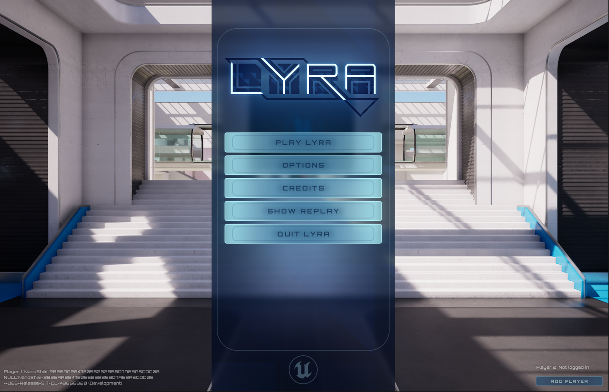

## 切入

主菜单的 LyraUserFacingExperienceDefinition 很容易找到

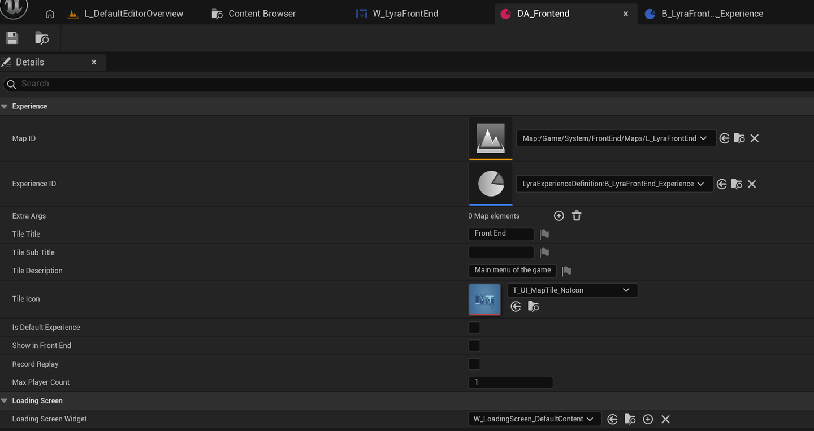

进而定位其 Experience

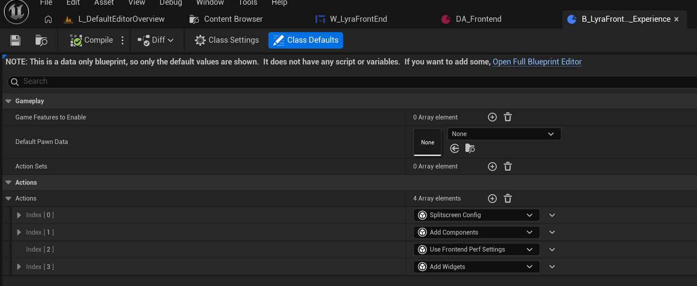

本文将分析这些 Actions. 除了 AddComponents 是 GameFeatures 插件自带的以外, 其他三个 Action 都是 Lyra 自己实现的. 而其中 SplitscreenConfig 和 AddWidgets 都继承于 UGameFeatureAction\_WorldActionBase. 下面先看看 UGameFeatureAction\_WorldActionBase 的源码

## GameFeatureAction\_WorldActionBase

> 在实现 Action 的时候有一个值得注意的地方是，因为 GameFeaturesSubsystem 是继承于 EngineSubsystem 的，因此 Action 的作用机制也是 Engine 的，因此在编辑器里播放游戏和停止游戏，这些 Action 其实都是在激活状态的。 (以上来自[《InsideUE5》GameFeatures 架构（六）扩展和最佳实践（完结） - 大钊的文章 - 知乎](https://zhuanlan.zhihu.com/p/504090910))

实际上, 在 Experience 加载的三个阶段中的 Action 加载阶段, 也有一些关于 Action 的注释

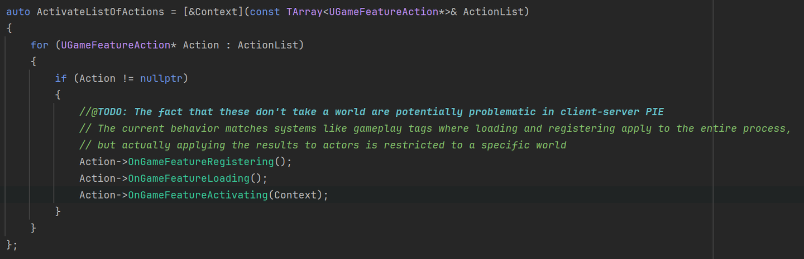

大意就是 GameFeatureAction 是针对整个进程生效的, 但"将 Action 应用到 actor 身上"这个行为是发生在特定 world 中的. 为了让 Action 能够拿到 World, UGameFeatureAction\_WorldActionBase 应运而生

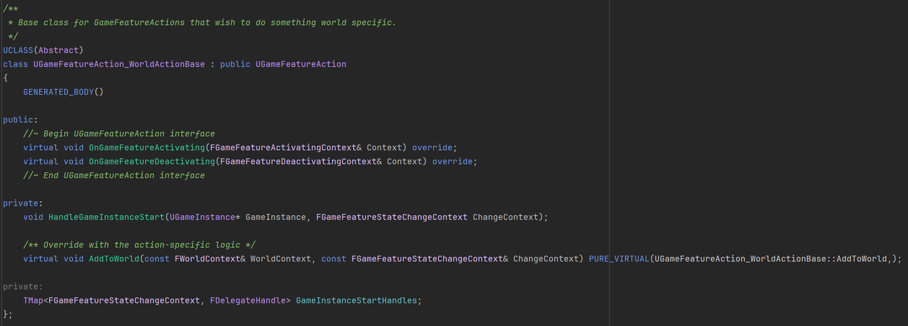

相比于普通的 GameFeatureAction, 在我看来 UGameFeatureAction\_WorldActionBase 有两个优点:

1. 监听 FWorldDelegates::OnStartGameInstance 事件, 确保在游戏开始的时候执行一次逻辑.
2. 增加了 AddToWorld 函数, 让 Action 能够拿到 World, 进而执行特定于 World 的行为.

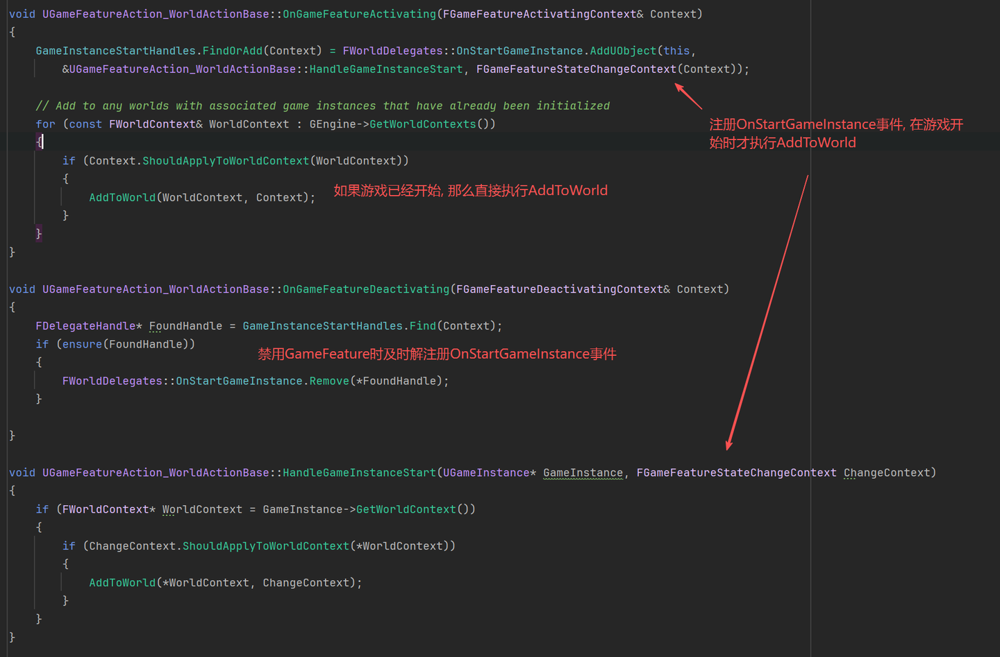

可以看到, UGameFeatureAction\_WorldActionBase 确保了**不同情况**下 AddToWorld 的执行. 为了理清楚所谓的"**不同情况**", 我翻到了[释天](https://www.zhihu.com/people/zhang-bo-38-33)大神的文章: [UE5 Lyra 项目的解析与学习四：GameFeatureAciton_AddWidget 与 UIExtension - 知乎](https://zhuanlan.zhihu.com/p/27336681595) 这篇文章中详细讲解了此问题. 下面是我自己过完代码的一点浅见, 也强烈推荐看一下释天大神的文章.

## GameFeatureAction\_AddComponents 运行机制拆解

事实上, UGameFeatureAction\_WorldActionBase 中的代码就是参考 AddComponents 的. 包括监听 GameInstanceStart 事件, AddToWorld 函数等.

作为 GameFeatures 框架中极为关键的函数, 理解好 AddComponent 对我们后续理解 Lyra 自定义的 Action 有非常大的帮助. 理解的关键点就是弄明白 Component 是怎么通过 Action 添加到 Actor 身上的, 在此我描述一下大致的流程:

首先要引入 **GameFrameworkComponentManager**.  它有几个关键函数: **AddReceiver**, **CreateComponentInstance**, **AddComponentRequest**.  还有一个关键变量 **ReceiverClassToComponentClassMap**, 主要是建立 Actor 到 ComponentRequest 之间的映射.

为了能够被 AddComponents 添加 Component, **一个 Actor 在 BeginPlay 中需要调用 GameFrameworkComponentManager::AddReceiver.**

AddComponents 在 AddToWorld 中会调用 AddComponentRequest, 申请向对应的 Actor 类身上添加对应的组件. 在 AddComponentRequest 会更新 ReceiverClassToComponentClassMap, 并且如果对应的 ActorClass 已经初始化, 那么调用 CreateComponentInstance 在所有该类 Actor 身上添加 Component(在编辑器下会先检查该 Actor 是否调用了 AddReceiver 函数) (再次强调: AddComponents 会一次性对整个 Actor 类的所有已调用 AddReceiver 的个体都添加 Component)

当 Actor 在 BeginPlay 中调用 AddReceiver 时, AddReceiver 中会查找 ReceiverClassToComponentClassMap 中对应的 ComponentRequest, 调用 CreateComponentInstance 在 Actor 身上添加对应 Component. (再次强调: AddReceiver 只会对 Actor 自身添加对应 Component)

其次就是关于监听 GameInstanceStart 事件. 可以认为 UGameFeatureAction\_WorldActionBase 中关于监听该事件的代码跟 AddComponents 中的一样.

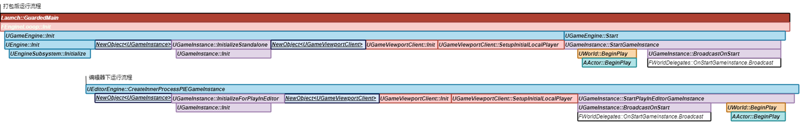

引用自释天大神的文章

这张图给出的堆栈情况, 对于我们的分析非常有用. 这张图分了打包后的以及编辑器中的运行流程. 只需要看最重要的三个函数: UEngine::Init, UGameInstance::BroadcastOnStart, AActor::BeginPlay.

GameFeaturesSubsystem 是继承 EngineSubsystem 的, 所以在 UEngine::Init 之后的任意阶段都可能触发 GameFeatureActivating, 并且从 Init 到后两个函数之间有非常大的间隔.

GameFeatureActivating 的触发时机一共有四种情况:

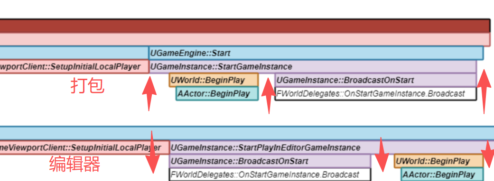

1. 触发时 AActor::BeginPlay 和 UGameInstance::BroadcastOnStart 都没调用. 那么此时注册了 GameInstanceStart 事件. 等事件触发时调用 AddToWorld, 进而更新 ReceiverClassToComponentClassMap. 如果 AActor::BeginPlay 已调用(对应打包后的流程), 那么此时直接为 Actor 添加 Component. 如果 AActor::BeginPlay 还没调用, 那么反正 ReceiverClassToComponentClassMap 已经更新了, 等 Actor 自己在 BeginPlay 中调用 AddReceiver 就行, AddReceiver 会自己在 Map 中查找组件然后给它添加上.
2. 触发时 AActor::BeginPlay 已经调用过了, 但 UGameInstance::BroadcastOnStart 还没调用. 此时调用 AddToWorld, 直接通过 AddComponentRequest 为 Actor 添加组件. 然后等到 GameInstanceStart 事件触发后, 又会调用一次 AddToWorld, 但这里不用担心, **Manager 不会再次为 Actor 添加组件**. 这是因为 Manager 有一个变量 RequestTrackingMap, 这个 Map 会根据 ComponentRequest 中的 Receiver 和 Component 来辨别不同的 ComponentRequest. 在这种情况下, 第二次创建的 ComponentRequest, 其 Receiver 和 Component 与第一次创建的是一致的, 所以 Manager 会认为这是重复的 Request, 只会将计数加一. 而每个 Request 的 Handle 在析构的时候都会将计数减 1, 当计数为 0 时会将 Component 移除.
3. 触发时 UGameInstance::BroadcastOnStart 已经调用过了, 但 AActor::BeginPlay 还没调用. 乍一看好像有点问题, 但实际上在编辑器状态下, World 已经存在了. 所以 GEngine-\>GetWorldContexts()依旧是可以拿到 WorldContext 的, 因此照常调用 AddToWrold 更新 ReceiverClassToComponentClassMap, 等到 AActor::BeginPlay 调用 AddReceiver 时, Component 就加上去了.
4. 触发时 AActor::BeginPlay 和 UGameInstance::BroadcastOnStart 都调用过了. 这种情况下在 AddComponentRequest 中直接就给所有对应的 Actor 添加上 Component 了.

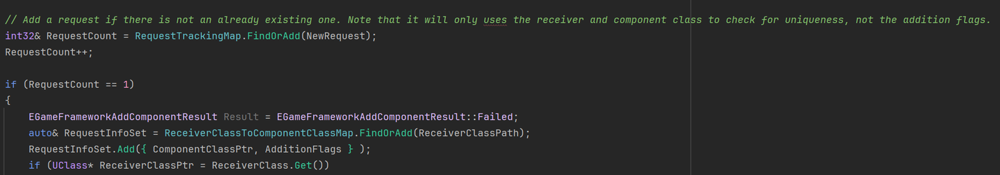

AddComponentRequest 中计数相关代码

第四种情况在 Lyra 中基本是最常见的情况, 因为 Lyra 在 Experience 加载的时候才激活 GameFeature, 在 ExperienceManager 的 EndPlay 中会禁用该 Experience 所加载的 GameFeature, 可以认为是在游戏开始后动态进行激活与禁用的. 所以如果你打断点测试会发现监听 GameInstanceStart 事件的回调函数几乎不会被触发.

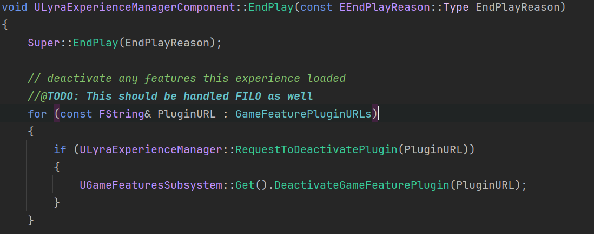

至此就大致分析完 AddComponents 的运行机制了. 当然这里只是介绍了怎么添加 Component 的这个流程. 对其有了概念之后, 还需要看 Lyra 是如何利用 GameFrameworkComponentManager 实现自定义的 Action 的.

## GameFrameworkComponentManager Extension System

经过前面的分析, 我们知道 AddComponent 是通过 AddReceiver, CreateComponentInstance, AddComponentRequest.  还有一个关键变量 ReceiverClassToComponentClassMap 来联动实现的. 同样地, Manager 为我们提供了类似逻辑的拓展接口. 但不同的是, 拓展接口是基于**事件触发**来进行的.  一定要尽量用类比的眼光来看 Extension System, 理解得会更快. 下面罗列他们的对应关系, 尽量感受一下.

AddExtensionHandler: 对应 AddComponentRequest.

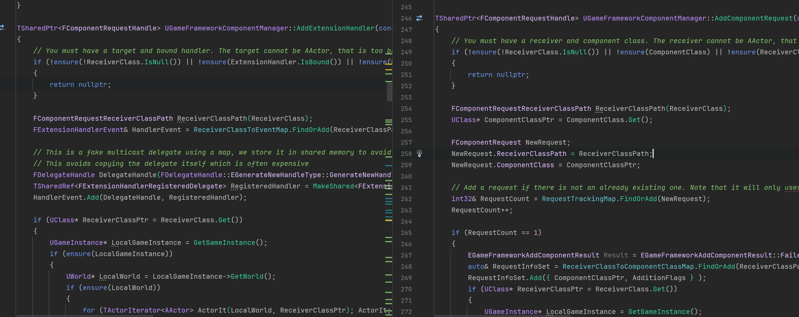

SendExtensionEvent: 对应 AddReceiver.

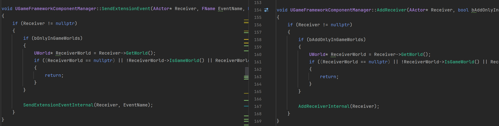

ReceiverClassToEventMap: 对应 ReceiverClassToComponentClassMap. 可以简单认为每个 Actor 类对应多个委托. (类比 ReceiverClassToComponentClassMap 就是每个 Actor 类对应多个 Component 类)

CreateComponentInstance: 对应 Excute. 委托所绑定的函数自己实现想要的功能.

而 Extension System 默认定义了五个事件. 在 Excute 委托的时候, 事件的名称将作为参数传入.

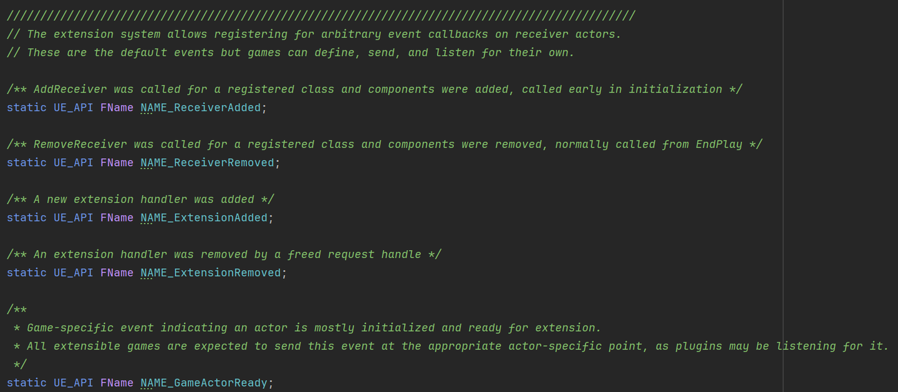

NAME\_ExtensionAdded 事件在 AddExtensionHandler 函数中被使用. (类比 AddComponentRequest 中会调用 CreateComponentInstance, AddExtensionHandler 也会调用 Excute, 此时传入 NAME\_ExtensionAdded).

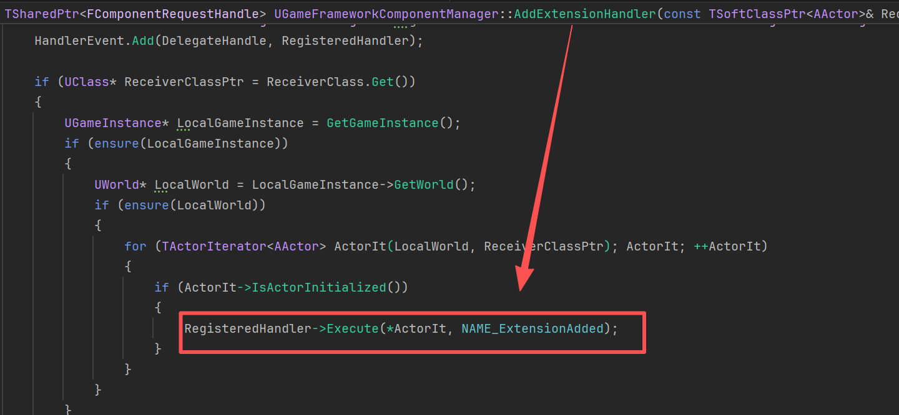

NAME\_GameActorReady 事件一般在 Actor 的 BeginPlay 中作为参数传给 SendExtensionEvent(类比 AddReceiver, 在 Actor 的 BeginPlay 中调用). 有时候也会用 SendGameFrameworkComponentExtensionEvent 函数. 这两个函数做的事情是一样的, 只是后者是个 static 函数, 省去了获取 Manager 的步骤.

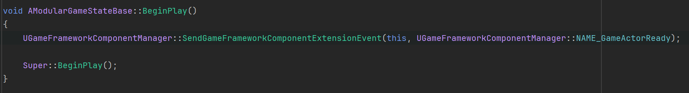

LyraGameState 继承的 ModularGameState

> 顺带一提, Lyra 中几乎没使用 AddReceiver 函数. 需要触发 GameFeature 的 Actor 都继承了 ModularXXX 父类, 这些父类在 BeginPlay 中就基本都执行 SendGameFrameworkComponentExtensionEvent(this, UGameFrameworkComponentManager::NAME\_GameActorReady); **而非 AddReceiver**. 但此时 AddComponent 依旧有用的原因前面也提到了, Lyra 几乎都是在 Experience 加载的时候才动态启用 GameFeature, 此时是能够拿到 World, 直接对 Actor 调用 CreateComponentInstance 的. 事实上, SendExtensionEventInternal 就是 AddReceiverInternal 的后半部分代码. 因此使用 SendExtension 是更简洁的.

NAME\_ReceiverAdded 事件则是直接在 AddReceiver 函数中作为参数传给 Excute. 所以你会发现 AddReceiver 其实不只适用于 AddComponent, 也可以对自定义的 Action 使用. 也因此, 虽然前面说用类比的眼光来看, 但也不完全是一对一的关系, Extension System 提供的基于事件的拓展, 其灵活性要高非常多, 如果足够熟悉, 换着花样用也没问题.

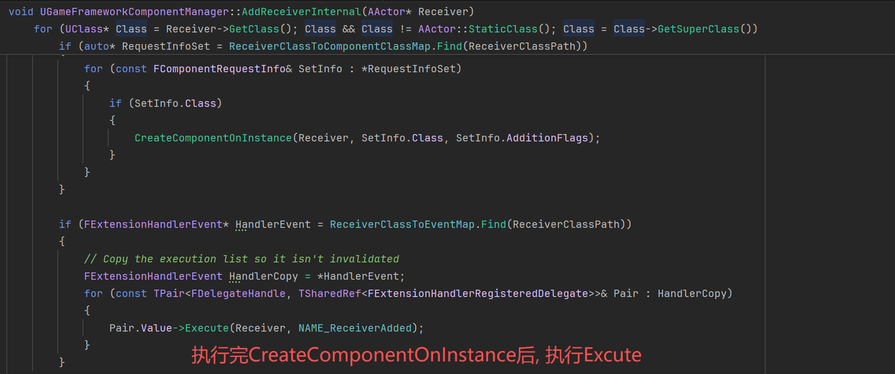

剩下的 Remove 事件就是用于管理生命周期, 及时销毁. 这一块细究起来也比较复杂, 此处略过.

## GameFeatureAction\_AddWidgets

再以 GameFeatureAction\_AddWidgets 为例讲一下使用流程, 捋捋思路(为了方便对比, 我将前文写的 AddComponent 的流程再次贴在这里)

> AddComponents 在 AddToWorld 中会调用 AddComponentRequest, 申请向对应的 Actor 类身上添加对应的组件. 在 AddComponentRequest 会更新 ReceiverClassToComponentClassMap, 并且如果对应的 ActorClass 已经初始化, 那么调用 CreateComponentInstance 在所有该类 Actor 身上添加 Component(在编辑器下会先检查该 Actor 是否调用了 AddReceiver 函数) (再次强调: AddComponents 会一次性对整个 Actor 类的所有已调用 AddReceiver 的个体都添加 Component) 当 Actor 在 BeginPlay 中调用 AddReceiver 时, AddReceiver 中会查找 ReceiverClassToComponentClassMap 中对应的 ComponentRequest, 调用 CreateComponentInstance 在 Actor 身上添加对应 Component. (再次强调: AddReceiver 只会对 Actor 自身添加对应 Component)

AddToWorld 中调用 AddExtensionHandler, 为配置好的 Actor 类绑定委托, 更新 ReceiverClassToEventMap. (类比 AddComponent 中调用 AddComponentRequest, 为 Actor 类绑定 ComponentRequest, 更新 ReceiverClassToComponentClassMap).

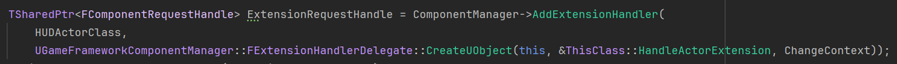

这个委托的回调函数 HandleActorExtension 实现想做的事情. 比方说显示 Widget. 当然我们前面提到 Excute 传入的参数有事件名, 所以需要根据事件名来处理不同的情况. 最常见的就是 Remove 事件做清理, Added 事件做显示(类比 CreateComponentInstance).

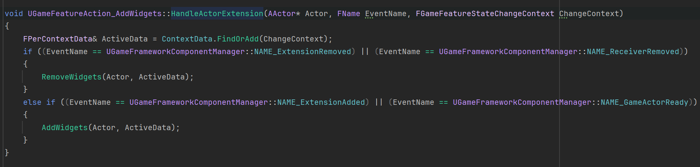

跟 AddComponentRequest 函数会尝试调用 CreateComponentInstance 一样, AddExtensionHandler 也会尝试调用 Excute, 传入 NAME\_ExtensionAdded, 执行这个回调函数.

类比 Actor 调用 AddReceiver, 当 Actor 在 BeginPlay 中调用 SendGameFrameworkComponentExtensionEvent(this, NAME\_GameActorReady)时, 该函数会为该 Actor 查找 ReceiverClassToEventMap, 触发绑定委托, 进而执行上面的回调函数, 传入的事件名自然就是 NAME\_GameActorReady.

可以看到, 跟 AddComponent 几乎一样. 所以总体流程我就不再花大篇幅详细拆解, 不过针对 AddWidgets, 依旧有些细节需要注意:

我们知道 AddComponent 的操作对象是 Actor, 往 Actor 身上添加 Component. 而 AddWidget 的操作对象是 HUD, 往 HUD 身上添加 Layout 和显示 Widget.

这时候重新看 AddToWorld 函数

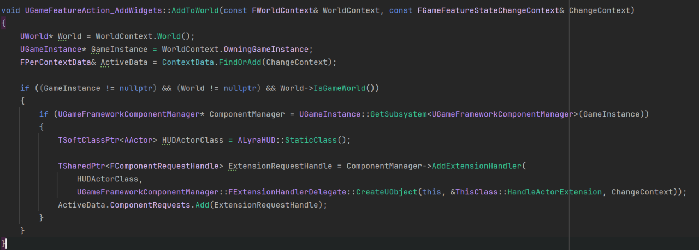

这里将 HUD 类作为 Receiver 传入 AddExtensionHandler 中. 那么 AddExtensionHandler 会遍历所有该 HUD 类的 Actor, 对他们执行回调函数 HandleActorExtension.

AddExtensionHandler 跟 AddComponentRequest 一样, 返回的依旧是 ComponentRequest, 这里算是一种复用, 我们就当成是 Request 就行, 不用管"Component".

而 ChangeContext 也非常关键. 它是一个 FGameFeatureStateChangeContext 类型的引用. 如果有阅读过源码, 会发现这个东西在整个 GameFeatureAction 中经常出现. 比方说 OnGameFeatureActivating, AddToWorld 等.

## FGameFeatureStateChangeContext

简单来说, 这玩意就是当 GameFeatures 启用或者禁用的时候, 用来判断这次启用或者禁用是否该应用于某个 World . 下面是它的结构, 可以简单看看, 但它本身不是重点.

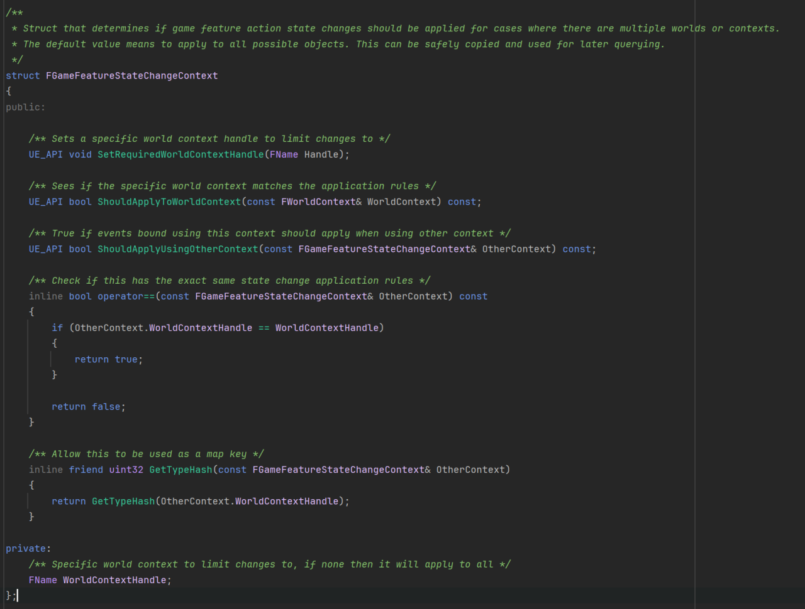

在 Lyra 实现的 AddWidgets 中, 以及 GameFeatures 插件自带的 AddComponent 中, 都定义了一个 TMap\<FGameFeatureStateChangeContext, xxxx\>私有变量.

可以认为, 这个私有变量进一步存储了"当前 Action 做了什么事情". 比方说, 在 AddComponent 中, 就映射到一个数组, 该数组存储"做了哪些 ComponentRequest". AddWidgets 用同样的方法不仅存储了 Request, 还存储了"生成哪些 Layout", "显示哪些 Widget".

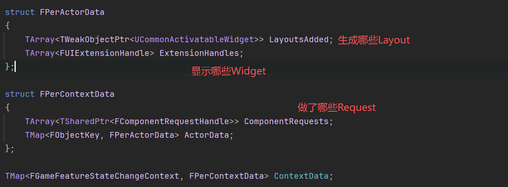

AddWidget 中的定义的 TMap

这时候再看 HandleActorExtension, 或者 AddToWorld, 就会更清晰. 他们都将 ContextData 作为传输数据, 存储数据, 查询数据的终端.

然后我们就可以进一步来看 AddWidgets 函数了.

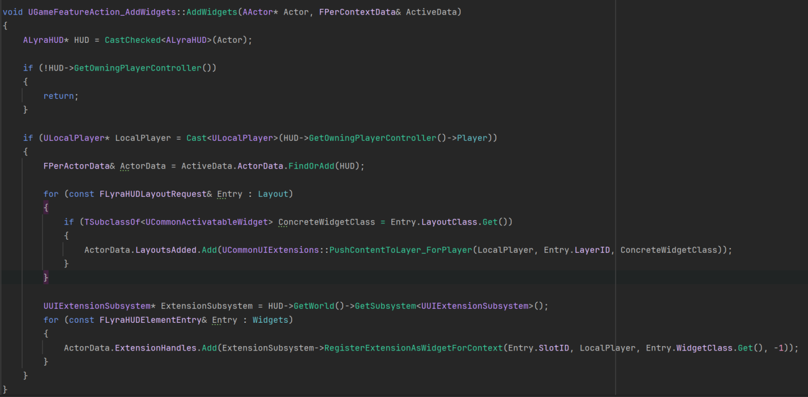

有了前面讲的基础, 这里就非常容易看懂了. 从 HUD 获取 PlayerController, 进而获取 Player. 然后利用 CommonUIExtensions 的接口为该 Player 显示我们配置的 Layout. 对于 Widget 也是同理, 利用 UIExtensionSubsystem 的接口来为该 Player 显示我们配置的 Widget.

代码中有 LayerID 和 SlotID, 他们本质上都是在利用 GameplayTag 来为该 Layout 或者 Widget 指定要显示的层级. Lyra 中 UI 显示有四个层级.

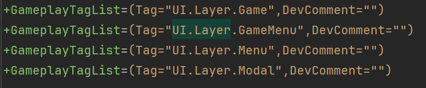

上文提到的 CommonUIExtension 和 UIExtension, 展开来讲又是另外的框架了, 但本文讲解 GameFeatureAction\_AddWidget 只是作为 GameFeatureAction 的一部分内容, 所以就不过多展开 UI 相关的内容了. 有机会再写文章讲解(新坑 ++).

Experience 中涉及到的 GameFeatureAction, 比较重要的两个: AddComponent, AddWidget 都讲完了. 回顾开头的四个 Action 中, 还有两个 Action 我们没讲, 感兴趣的读者可以自行查看源码, 有了本文的基础, 相信不难看懂.

## 待续

本想这段时间整体将主菜单的实现分析完, 但是涉及到的模块太多了, 包括 Experience, GameFeature, UIExtension, UserSubsystem, SessionSubsystem. 能力有限, 待之后慢慢分析吧. 等这部分的一点小细节学完, 打算看看 Lyra 的 Gameplay 那一块.

> 参考:
>
> [《InsideUE5》GameFeatures架构（六）扩展和最佳实践（完结） - 大钊的文章 - 知乎](https://zhuanlan.zhihu.com/p/504090910)
>
> [UE5--PrimaryDataAsset 资产包更新 UpdateAssetBundleData 源码分析 - niansoou 的文章 - 知乎](https://zhuanlan.zhihu.com/p/700154501)
>
> [UE5 Lyra 项目的解析与学习四：GameFeatureAciton_AddWidget 与 UIExtension - 知乎](https://zhuanlan.zhihu.com/p/27336681595)
