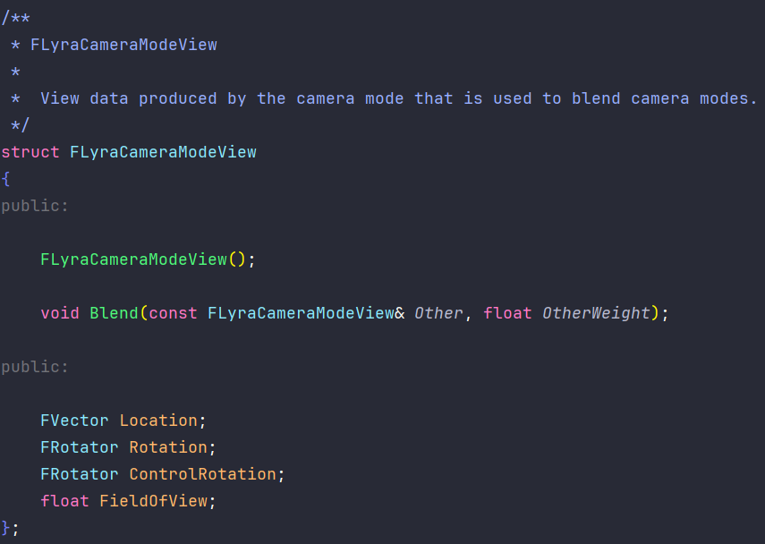
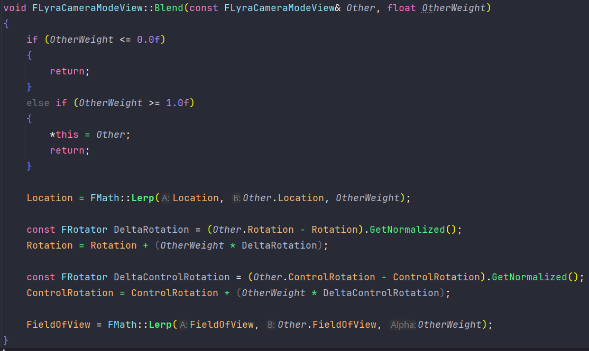
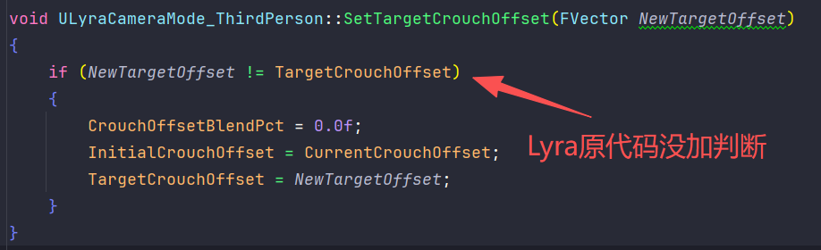
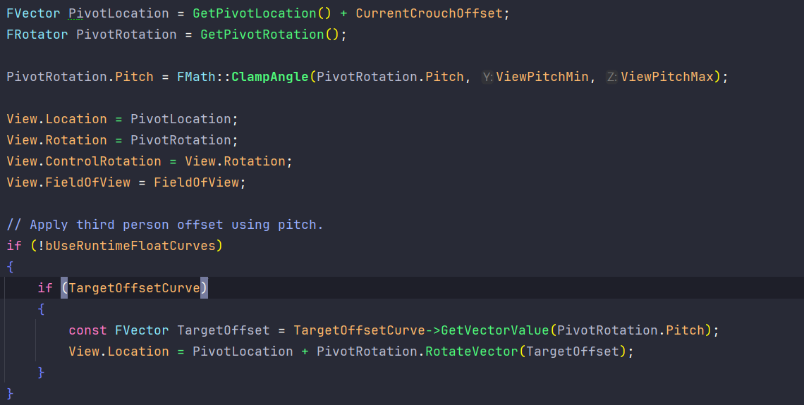
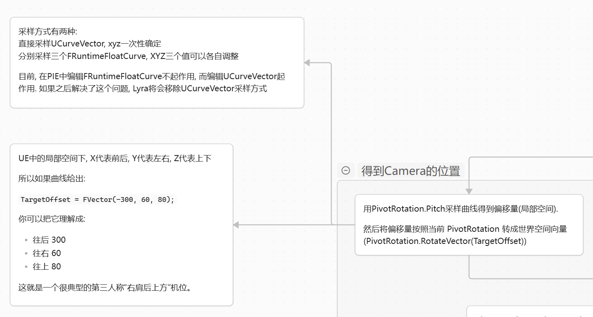
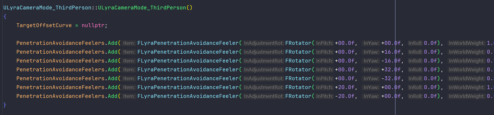
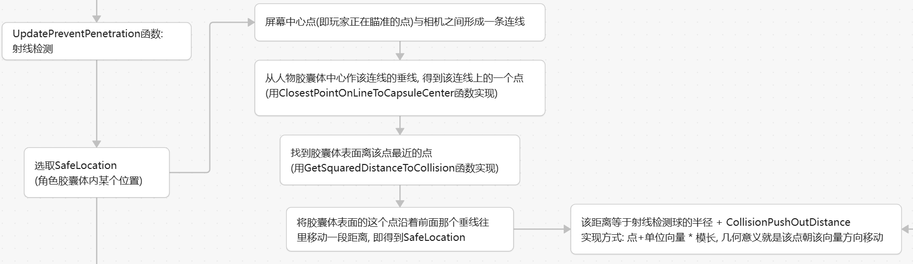
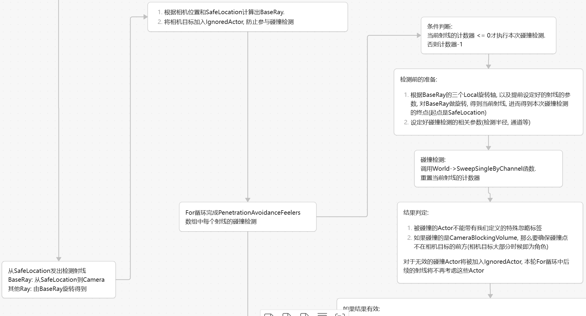
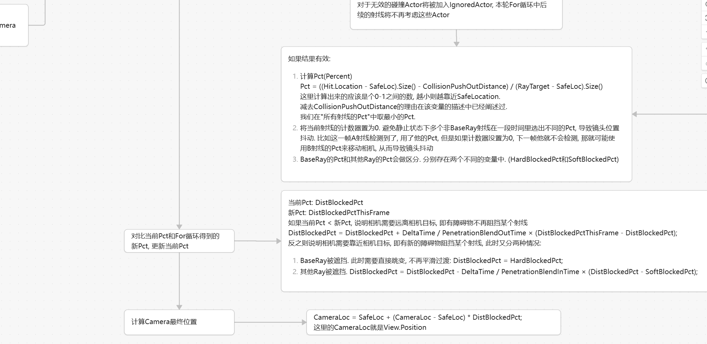

# Lyra相机方案拆解与拓展

> 本文中可能存在称呼混用的问题, 比如LyraCameraComponent偶尔会被我称为CameraComponent, 需注意与UE原生的CameraComponent做区分, 其他名词同理.

# LyraCameraModeView

Lyra用一个结构体`FLyraCameraModeView`来描述相机. 其中封装了:

1. 相机的旋转, 位置, FOV.
2. ​`Blend()`​函数, 定义了如何与另一个`FLyraCameraModeView`做融合.

可以认为是对UE原生`FMinimalViewInfo`的简化.

简单过一下结构体内的`Blend`函数: 传入另一个View的引用, 以及另一个View的权重. 然后更新当前View的成员. Location就是用二者的Location配合传入的权重做一下Lerp, Rotation则是让自己的Rotation往另一个View的Rotation偏, 主要实现方式是两向量相减后归一化得到deltaRotation, 然后当前Rotation + deltaRotation × 权重, FOV更新方式同Location.

此外, 结构体中的Rotation区分了相机Rotation和ControlRotation. 前者是相机实际上的Rotation, 后者则是玩家控制器朝向. 大部分时间后者等于前者, 但少部分时间(比如需要运镜), 那么后者可能会不等于前者.

# CameraMode

Lyra相机系统中最关键的类. 其成员包含了上面所说的**View**, 还定义了在多CameraMode场景下, 当前CameraMode应当被如何**Blend**.

CameraMode提供一系列接口让其他类能够获取部分数据, 比较关键的有以下函数:

1. ​`GetPivotLocation()和GetPivotRotation()`, 返回Pivot的位置和朝向. 这个Pivot可以认为是计算相机View的基准.

   ​`GetPivotLocation()`​做的事情就是返回角色眼睛高度的位置. (`TargetCharacter->GetActorLocation() + TargetCharacterCDO->BaseEyeHeight`​ ), 但确保当角色下蹲(Crouch)的时候, 返回的位置依旧不变. 所以在其内部做了一些计算, 即根据胶囊体的CDO的HalfHeight和胶囊体实际HalfHeight的差, 对结果做调整.  
   ​`GetPivotRotation()`​则是简单返回**玩家控制器**朝向.

   **这两个函数将在子类"计算相机位置"的时候起到重要作用.**
2. ​`UpdateCameraMode(float DeltaTime)`. 可以理解为"更新我自己"

   内部调用`UpdateView()`​和`UpdateBlending()`函数, 实时更新View和Blend参数.

   ​`UpdateView()`​对View的更新很简单, 就是直接类似`View.Location = GetPivotLocation()`, 参考价值不大.

    **一般而言需要继承CameraMode并重写**​**​`UpdateView`​**​**函数(比如下面的CameraMode_ThirdPerson子类), 因为View几乎等价于相机本身. .**

   ​`UpdateBlending()`​则是每一帧都让`BlendAlpha`​(可以认为是Blend进度)增加`DeltaTime / BlendTime(Blend总时长)`​, 然后用`BlendAlpha`​对**​`BlendWeight`​**​从零到一插值. 这里插值的方式也可以定义, 最常见的就是线性linear, 直接`BlendWeight = BlendAlpha`. 其他的还有EaseIn(淡入), EaseOut(淡出), EaseInOut(淡入淡出)等等.

   ​**​`UpdateBlending`​**​**中更新的**​**​`BlendWeight`​**​ **, 将会用于**​**​`CameraModeStack`​**​**的Blend, 即多个CameraMode同时存在时, 利用他们的**​**​`BlendWeight`​**​**计算最终的View.**

   ​**​`UpdateCameraMode(float DeltaTime)`​** ​**函数将在每帧被调用, 以更新当前CameraMode.**

## CameraMode_ThirdPerson

继承CameraMode, Lyra借此实现高度可定制化的第三人称相机. 这个类做的事情就是重写`UpdateView()`函数, 以计算出正确的View.

在`UpdateView()`中主要做三件事:

首先,

CameraMode中实现了`GetPivotLocation()`, 确保角色下蹲前后, 返回的Pivot位置依旧不变. 而在当前类中, 会进一步计算当角色下蹲的时候, 这个pivot该如何变化.

 具体来说, 每一帧检测角色是否下蹲, 如果下蹲, 那么取角色CDO的`CrouchedEyeHeight`​和角色CDO的`BaseEyeHeight`​相减即得到**​`TargetCrouchOffset`​**​. 否则`TargetCrouchOffset`为0.

会有一个**​`CurrentCrouchOffset`​**​. 每一帧会往`TargetCrouchOffset`去靠近, 从而实现平滑过渡.

每次`TargetCrouchOffset`​更新时, 重置blend进度, 让`CurrentCrouchOffset`​重新往新的`TargetCrouchOffset`靠近.

> 这里讲点题外话, Lyra可能在这块写的不太对: `TargetCrouchOffset`是每一帧都更新的, 也就是说按Lyra的写法每一帧都会重置blend进度. 从实际效果来看没差, 但是从逻辑上来看, 应该加个判断, 当新的Target和原来的不同时才重置blend进度. 我加了判断测了下, 局内效果没什么问题.
>
> 

然后,

拓展`UpdateView`. View不仅仅只是停留在Pivot的位置, 而是往角色身后放, 那么该放在什么位置?

Lyra的解决方案是采样曲线. 利用PivotRotation的Pitch值, 采样一个三维曲线`TargetOffsetCurve`(分别对应XYZ的值), 然后从PivotLocation开始, 加上采样得到的向量, 实现相机位置的进一步移动.

采样得到的向量是Local空间的, 需要利用PivotRotation将其转到Global空间.

采样的具体细节:

最后,

做射线检测, 确定相机的最终位置.

关键成员变量: `PenetrationAvoidanceFeelers` 存储所有射线的参数, 比如旋转的角度, 检测的半径等等. 在实际计算的时候, 会根据设定的参数来旋转BaseRay, 得到新的射线. 在构造函数中, 添加了数个射线:

关键成员变量: `CollisionPushOutDistance`当得到射线检测的碰撞点时, 我们不能直接将相机放在那个位置, 否则相机会和检测到的物体重合导致穿模. 所以会往人物身上靠近一小段距离. 就是这个变量定义的距离

射线检测分为两个阶段:

1. 找射线检测的起点. 在代码中被称为SafeLocation.

   
2. 从SafeLocation发出检测射线

   (防止大图太糊, 这里分两次截\)

   

   

# LyraCameraComponent

挂载在Character类身上, 继承于UE原生的CameraComponent.

可以认为外界通过这个CameraComponent来获取相机的View信息, 所以这个CameraComponent就是负责协调外界调用与内部计算的.

LyraCameraComponent维护一个容器\: CameraModeStack. 这个容器跟字面意思一样, 是存储着所有CameraMode的栈.

LyraCameraComponent重写`GetCameraView(float DeltaTime, FMinimalViewInfo& DesiredView)`函数. 这个函数即为外界调用的接口, 所以也是CameraComponent实现的重点. 下面描述该函数的流程:

- 查询当前合适的CameraMode, 将其Push入栈.

  > 如何查询当前合适的CameraMode? Lyra实现在LyraHeroComponent中, 这个Component主要是来处理: 输入绑定, CameraMode更新, 以及ASC初始化.
  >
  > 你可以认为当有一个玩家来操控一个新生成的Character的时候, 这个Character身上挂载的LyraHeroComponent就开始初始化与这个玩家"操作"相关的内容, 并且保持维护.
  >
  > 比如之前存储在这个玩家的PlayerState中ASC信息要跟随到当前新生成的Character, 比如输入绑定(WASD移动这些), 比如当玩家开镜瞄准的时候, 相机要拉近, 这时候会使用GameplayAbility调用HeroComponent的相关接口来设置新的CameraMode, 或者默认状态下使用"生成Character时指定的PawnData"中的DefaultCameraMode.
  >
  > CameraComponent中定义了一个单播委托`DetermineCameraModeDelegate`, 而HeroComponent为这个委托注册了回调函数, 回调函数内就指定了当前合适的CameraMode. 每次CameraComponent想查询的时候就会Execute这个委托, 拿到当前合适的CameraMode.
  >

- 让栈自己做更新和计算(调用CameraModeStack的`EvaluateStack()`函数), 拿到最终的View.
- 将View的各个参数应用到各个地方.

  1. ​`PlayerController`的Rotation需要与最终View的Rotation对齐.
  2. 让`CameraComponent`组件本身的位置, 旋转, FOV等与View对齐.
  3. 将这个最终的View写入引用参数`DesiredView`​中. 注: 函数签名为`GetCameraView(float DeltaTime, FMinimalViewInfo& DesiredView)`

# CameraModeStack

在`CameraMode`​和`CameraComponent`​中都提到了`CameraModeStack`:

- 在`CameraMode`​中, 其Blend参数将被`CameraModeStack`使用.

- 在`CameraComponent`​中, 会将`CameraMode`​Push进`CameraModeStack`​, 并让`CameraModeStack`自己做更新.

​`CameraModeStack`内部维护两个成员:

- CameraModeInstances数组, 负责保存`CameraMode`​类的单例. 不论是入栈`PushCameraMode()`​, 还是其他操作, 都是传入`CameraMode`的Subclass, 函数内再从这个数组中拿到单例.
- CameraModeStack, 前面频繁提到的栈, 下面介绍的函数也都围绕这个栈做操作. **数组开头是栈顶, 新元素入栈是插入数组头部**.

先看入栈, 即`ULyraCameraModeStack::PushCameraMode(TSubclassOf<ULyraCameraMode> CameraModeClass)`, 其流程如下:

- 如果要入栈的CameraMode本来就在栈顶, 直接返回. 否则继续.
- 分两种情况:

  - 要入栈的CameraMode本来就在栈内. 那么计算其当前对最终View的贡献度.

    计算公式为: (1 - BlendWeight1) × (1 - BlendWeight2) × ... × 该CameraMode的BlendWeight. 这里的BlendWeight1指代栈顶元素的BlendWeight, 以此类推. (BlendWeight在CameraMode部分有提到过). 直观理解就是栈顶元素优先, 贡献最大.

    计算完毕后出栈, 将计算得到的贡献度作为BlendWeight设置给要入栈的CameraMode, 然后将其插入数组头部. 然后栈底元素的BlendWeight要置为1, 确保整体的贡献度加起来是1.
  - 要入栈的CameraMode原本不在栈内. 那么其贡献度就为0, 将0作为该CameraMode的BlendWeight.

将贡献度作为BlendWeight, 可以很大程度上环节切换CameraMode时带来的镜头跳变.

然后是`CameraModeStack`​自己做更新的函数, `EvaluateStack(float DeltaTime, FLyraCameraModeView& OutCameraModeView)`, 其内部走两个函数:

- ​`UpdateStack(float DeltaTime)`: 主要用于更新栈内每个CameraMode.

  会调用对应CameraMode的`UpdateCameraMode(float DeltaTime)`函数, 进而更新该CameraMode的View(碰撞检测导致View变化等)和增长BlendWeight.

  如果栈中某个CameraMode的BlendWeight达到了1, 那么其下方的CameraMode将被清除, 因为他们不再对最终View有贡献.
- ​`BlendStack(FLyraCameraModeView& OutCameraModeView)`: 从栈底元素开始, 往上做Blend. 具体流程是:

  - 选取栈底的CameraMode, 拿到他的View, 作为初始的View.
  - 调用初始View的Blend函数, 传入上方的那个CameraMode及其BlendWeight. 然后继续Blend上方第二个CameraMode, 以此类推.
  - 所有CameraMode都被Blend之后, 得到最终的View, 写入`OutCameraModeView`.

所以CameraMode的BlendWeight, 其实可以理解为"以多大的权重覆盖下方的已经合成好的结果", 从式子的角度来讲, 越早被加入计算的CameraMode, 所乘的BlendWeight就越多, 那么最后他的贡献就越被稀释, 这也是为什么从栈底开始往上Blend, 而非从栈顶开始.

# 总结

最后梳理一下整篇文章:

- LyraCameraComponent被挂载在Character身上. 每一帧, 其GetCameraView函数被调用.
- GetCameraView函数首先查询当前合适的CameraMode, 然后将其Push进CameraModeStack, 之后调用CameraModeStack的`EvaluateStack()`函数, 让其自己做更新和计算, 得到最终的View. 将得到的View应用到各个地方(如PlayerController等), 并写入结果.
- 以上即为整体的流程. 而具体到细节,

  Push的时候, CameraModeStack会计算要Push的CameraMode的贡献度, 将贡献度作为BlendWeight.

  EvaluateStack的时候, CameraMode会先更新栈内每个CameraMode, 清理无效的CameraMode. 然后从栈底往上做Blend, 得到最终的View.

  更新CameraMode的时候, 会调用`UpdateCameraMode()`函数, 这个函数会增长BlendWeight, 并且更新View.

  而CameraMode_ThirdPerson则是重写更新View的过程, 通过采样曲线和射线检测来更新View.

# 拓展

留几个Plan待实现:

(以下仅为初步构思, 供参考)

1. **基于这个架构实现CameraMode_FirstPerson (Lyra代码中还有CameraMode_TopDownArenaCamera):**

   首先是UpdateView, 应该是将View的Location放在角色的BaseEyeHeight, 更细致一点可以在资产中给mesh的头部某个位置创建个socket, 就把View放在这个Socket的位置. View的旋转则与PlayerController的旋转一致即可. 如果要实现呼吸等镜头摇晃功能, 仅改变Rotation即可, 不改变ControlRotation.

   然后需要隐藏头部, 可以通过CameraMode的`OnActivation()`等函数来触发隐藏逻辑.
2. **基于这个架构实现鼠标滚轮切换第一人称和第三人称:**

   假如默认是第三人称, 我的构思是, 鼠标滚轮放大可以让相机拉近放大, 等拉近到某个阈值后切换第一人称. 这里涉及两件事情: 相机根据滚轮缩放, 以及切换CameraMode.

   相机缩放: CameraMode_ThirdPerson中的TargetOffsetCurve曲线拆分成两个曲线: NearOffsetCurve和FarOffsetCurve, 自己调整近距离时的Offset和远距离时的Offset. 然后CameraMode_ThirdPerson中想办法响应鼠标滚轮事件, 根据事件改变某个变量(这里记为`TargetZoomAlpha`), 然后用这个变量在NearOffset和FarOffset之间插值. 当然, 也可以改View的FOV, FOV这块Lyra没怎么改, 我们可以自己根据感觉调整.

   切换CameraMode: 还记得CameraComponent查询CameraMode的流程吗? 显然切换CameraMode这块逻辑要放到HeroComponent了. 在那个回调函数中加入对`TargetZoomAlpha`这个值的判断, 如果大于某个值, 就返回第一人称的CameraMode. 这样就实现了切换.

   注意细节:

   - 不要把滚轮改变的值, 与距离搞混了. 比如碰撞检测可能导致相近离角色非常近, 但是不能因此就将视角改为第一人称. 视角的主动与被动改变需要区分.
   - 为了防止在第一人称和第三人称切换的边界抖动, 可以使用两个阈值: Enter阈值和Exit阈值, 两个阈值之间隔开一些距离. 如果当前处于第三人称, 要进入第一人称, 那么需要`TargetZoomAlpha`​大于Enter阈值; 如果当前处于第一人称, 要进入第三人称, 那么需要`TargetZoomAlpha`小于Exit阈值. ai说这种做法叫hysteresis.
3. **基于这个架构实现"视角锁定敌人"**

   这个功能可以通过AbilityCameraMode实现. 在CameraComponent中提到过HeroComponent可以让GameplayAbility调用对应接口来更改CameraMode, 这个接口就是`SetAbilityCameraMode()`. HeroComponent维护一个AbilityCameraMode成员, 在CameraComponent查询CameraMode的时候, HeroComponent的AbilityCameraMode成员如果不是null就会将其对应的CameraMode直接返回.

   - 定义一个`TargetLockComponent`, 专门处理目标锁定的逻辑和数据. 主要维护:

     1. 锁定点(包含Actor, Socket信息等. 敌人身上可以创建专门用于锁定的socket, 放在头部或者身体等部位)
     2. 锁定目标的逻辑, 目标可以是距离准心最近的敌人等等, 甚至敌人身上可以有锁定优先级, 优先锁boss, 总之计算方式可以根据需求来. "锁定目标"本身可以封装成一个接口函数给其他类调用.
     3. 如果要实现当玩家在锁定视角下左右移动鼠标时, 切换锁定目标, 那么还需要能够获取ControlRotation, 算出相对于屏幕中心的YawOffset和PitchOffset, 并且定义阈值, 当offset超过某个阈值时切换目标. 这块同样可以使用"双阈值"的思想.
   - 定义一个GameplayAbility_TargetLock. 按下鼠标中键时激活这个GA, 调用`SetAbilityCameraMode()`​覆盖CameraMode, 同时激活`TargetLockComponent`​或者说调用`TargetLockComponent`的"锁定目标"接口.  当无有效目标、玩家再次按下中键、角色死亡、或被其他Ability取消时，结束当前GA，并调用ClearAbilityCameraMode()清理相机覆盖。
   - 定义`CameraMode_TargetLock_ThirdPerson`​, 继承于`CameraMode_ThirdPerson`​或者直接继承`LyraCameraMode`.

     重写`GetPivotRotation()`​. 首先从相机目标身上找到`TargetLockComponent`​, 以此拿到锁定的Actor和位置, 然后据此拿到PivotRotation. 在`UpdateView()`函数中, 根据PivotRotation来更新View的Rotation. 对于ControlRotation, 可以是Rotation加上YawOffset和PitchOffset, 不过这块可能还要更进一步考虑, 这里只是初步构思, 比较粗糙.

     还需要定义切换目标时, 视角转动的速度等等参数, 执行视角转动可以封装为另一个函数, 并参考`CameraMode_ThirdPerson`​对于CrouchOffset的相关实现.(`UpdateCrouchOffset()`函数)

     所以根据实际情况, 从重写`UpdateView()`​的角度讲也许`CameraMode_TargetLock_ThirdPerson`​直接继承`LyraCameraMode`​而非`CameraMode_ThirdPerson`​, 是更灵活的选择. 但是碰撞检测等算法又与`CameraMode_ThirdPerson`中的相同, 还是需要根据需求做设计.

   - 最后注意, 一般来说这个功能开启之后, 角色就要变成与视角朝向同步了, 也就是转动视角的时候整个角色也会跟着转, 别忘了.

‍
