# Lyra角色系统入门

# 角色生成流程

GameMode会在Experience加载完成的回调函数中启动角色生成流程:

(Experience加载, 你可以认为是在加载Level的基础上额外指定一些加载信息, 有兴趣的可以看[Lyra(一) 地图切换 & Experience加载 & Loading界面 | 如珩的博客](https://nanoshiki.top/Blog/post.html?id=UE_Lyra_Lyra(%E4%B8%80)%20%E5%9C%B0%E5%9B%BE%E5%88%87%E6%8D%A2%20%26%20Experience%E5%8A%A0%E8%BD%BD%20%26%20Loading%E7%95%8C%E9%9D%A2))

- Restart所有"还没有Pawn的PlayerController". 进一步触发调用链: RestartPlayer -> RestartPlayerAtPlayerStatr -> SpawnDefaultPawnAtTransform, 开始生成角色.

- 在SpawnDefaultPawnAtTransform中, 找到要生成的Pawn类. 优先选择当前Experience配置的PawnData(用于配置角色生成相关信息的一个DataAsset, 后面会讲)中指定的PawnClass, 其次选择GameMode中指定的PawnClass. 以Lyra编辑器默认地图为例, PawnData中配置的PawnClass为B_SimpleHeroPawn. 其资产预览如下

  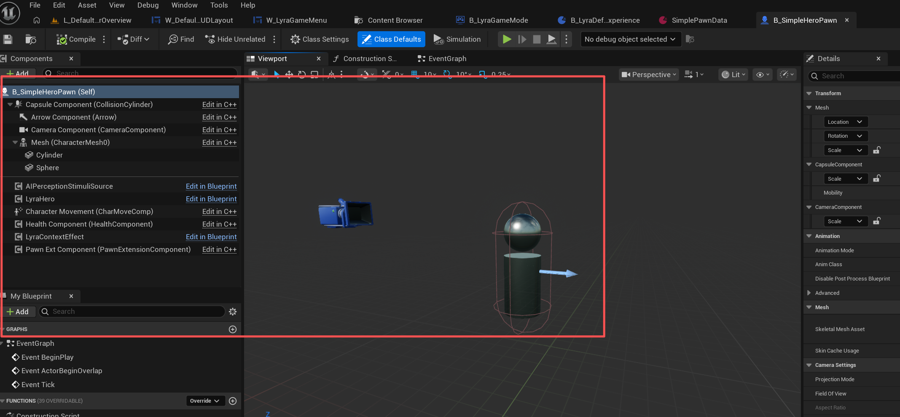

在角色生成之后, 就进入了角色本身的初始化流程.

# LyraCharacter

LyraCharacter类中, 有不少业务相关的东西, 比如HealthComponent, 比如Team, 比如处理加速度的网络同步, 比如负责Cache地面信息的LyraCharacterMovementComponent.

但是本文的重点在于, 如何从零开始, 将Lyra的**WASD移动+鼠标旋转视角**, 这一套流程移植和复现, 所以这部分业务相关的内容不会展开讲.

涉及的组件如下:

- CameraComponent: 可以见文章: [Lyra相机方案拆解与拓展 | 如珩的博客](https://nanoshiki.top/Blog/post.html?id=UE_Lyra_Lyra%E7%9B%B8%E6%9C%BA%E6%96%B9%E6%A1%88%E6%8B%86%E8%A7%A3%E4%B8%8E%E6%8B%93%E5%B1%95) 本文将默认已有该文章的基础.
- LyraHeroComponent: **主要负责响应玩家的操作**. 比如输入绑定(wasd移动, 鼠标转视角等), 比如判断当前合适的CameraMode.
- PawnExtComponent: Lyra角色系统的核心组件之一. **主要负责角色各个组件的初始化**. 比如上面提到的HeroComponent, 比如ASC.
- LyraInputComponent: 我们将在InputConfig中配置输入绑定相关的内容, 而LyraInputComponent就负责提供接口, 将InputConfig中配置的输入与我们传给它的回调函数进行绑定. 它提供的接口会被LyraHeroComponent所使用.

去掉业务内容后, LyraCharacter做的东西其实就不是特别多了, 事情都是组件在做, LyraCharacter就在合适的时机通知这些组件做事, 所以, 更关键的是理解好上面提到的这些组件.

# InputComponent

需要在项目设置中将默认InputComponent设置为新创建的LyraInputComponent, 别忘了.

主要就做一件事: 绑定.

Lyra将一个InputAction与一个GameplayTag封装起来, 抽象为**LyraInputAction**.

Lyra创建了一个DataAsset类: InputConfig, 类内部维护两个LyraInputAction数组, 分别为NativeInputActions和AbilityInputActions. 前者用于普通的输入行为, 比如WASD移动和鼠标转动视角, 后者用于GAS的Ability触发. 我们创建InputConfig资产, 在其中配置好IA和Tag.

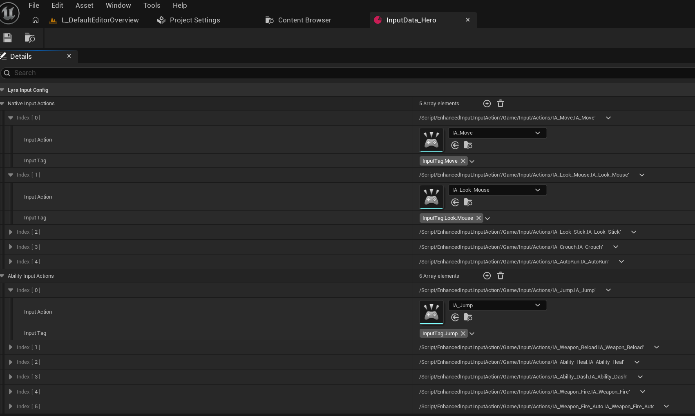

然后需要在PawnData中指定这个资产.

InputComp中定义两个函数: BindNativeAction和BindAbilityActions, 就是将InputAction与回调函数对应起来. 这两个函数将被HeroComp在初始化输入的时候调用.

HeroComp从PawnData中读取InputConfig, 拿到所有LyraInputAction. 然后为每个NativeInputAction都定义了一个回调函数, 比如WASD的回调函数是让角色移动, 然后调用BindNativeAction为每个NativeInputAction绑定到定义好的回调函数. 但是只为所有AbilityInputActions定义共同的回调函数, 回调函数内会让ASC根据AbilityInputAction的GameplayTag来执行对应操作(比如激活某个GA).

当然, 这只实现了IA到回调函数的映射. 还需要实现按键到IA的映射. 所以要创建InputMappingContext, 并在HeroComp中指定.

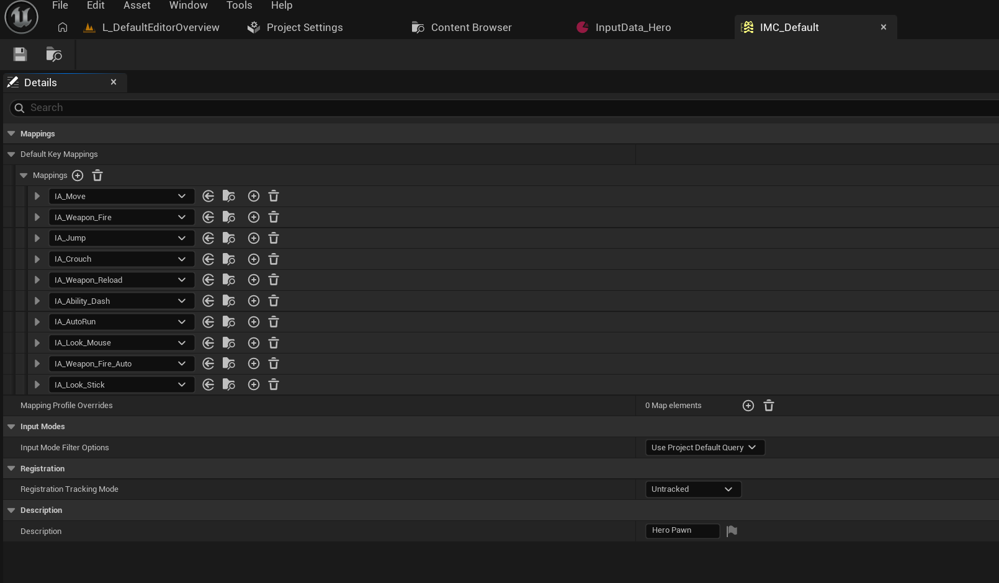

# PawnExtComponent

PawnExtComp是Lyra角色系统的核心组件之一. 主要负责角色各个组件的初始化. 在Lyra中, PawnExtComp主要负责HeroComp和ASC的初始化.

- 需要存储PawnData, 才能通过PawnData中配置的内容来初始化HeroComp.

- 同时, 为了方便, 还存储了当前Pawn身上的ASC.

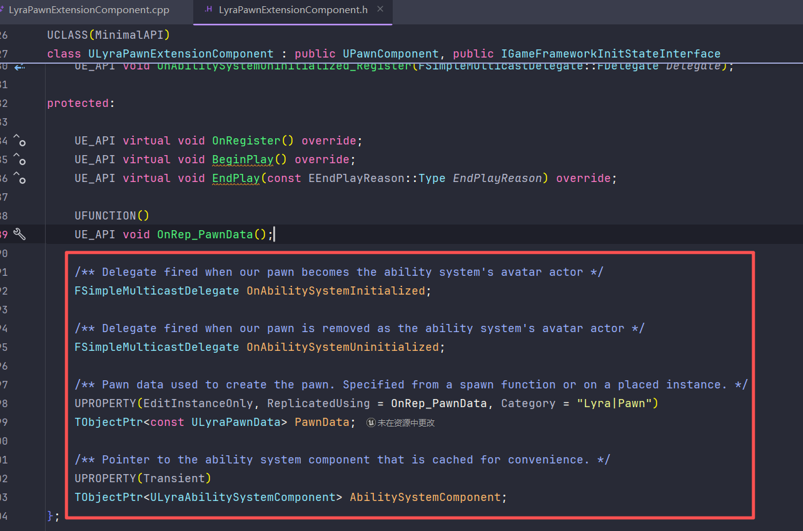

(ASC挂载在PlayerState中, PawnExtComp中的ASC只是个Cache)

## **GameFrameworkInitState框架**

PawnExtComp**借助GameFrameworkInitState框架, 实现基于状态的初始化**. 所以这里先介绍一下PawnExtComp是如何使用这个框架的:

PawnExtComp继承了IGameFrameworkInitStateInterface接口, 并实现了接口内的部分函数:

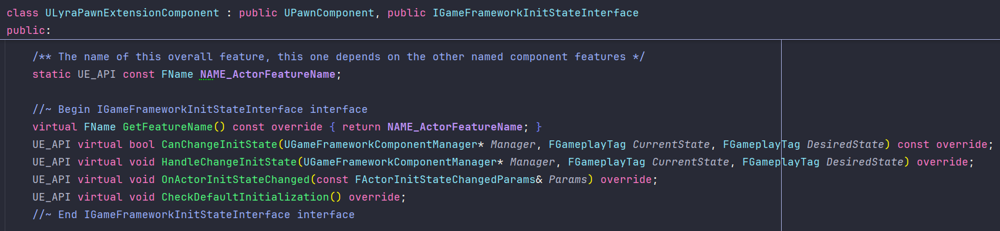

下面一一介绍这些函数:

- **GetFeatureName**:

  每个注册到GameFrameworkInitState框架的组件都要创建一个静态字符变量, 用于标识自己的身份.

  ```c++
  const FName ULyraPawnExtensionComponent::NAME_ActorFeatureName("PawnExtension");
  ```
- **CanChangeInitState**:

  传入当前状态和目标状态. 函数内部会判断是否能够从当前状态转移到目标状态. 如果返回true, 那么接下来会交给HandleChangeInitState. 例如, 从"数据准备好了"到"完成初始化"
- **HandleChangeInitState**:

  传入当前状态和目标状态. 执行我们想做的操作. 比方说CanChangeInitState判断从"数据准备好了"到"完成初始化"这个转换是true, 那么HandleChangeInitState就来用这些数据完成初始化, 让状态真正过渡到"完成初始化".
- **OnActorInitStateChanged**:

  监听别人的InitState流转. 在PawnExtComp的BeginPlay函数中, 注册了对所有Actor的InitState的监听:

  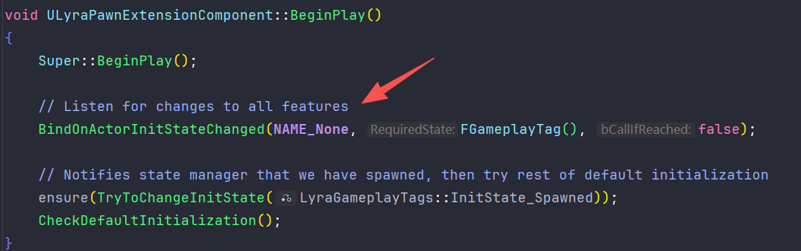

  所以当有任何Actor的InitState发生改变时(也监听了自己的变化), 会调用PawnExtComp的OnActorInitStateChanged函数.

  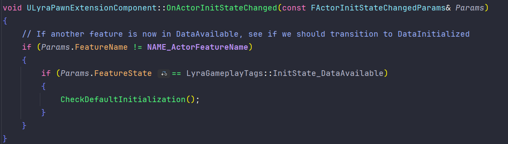

  这里逻辑很清晰, 就是说当有人达到"数据准备好了"状态时, 尝试推进初始化进程. 可以看一下**CheckDefaultInitialization**函数:

  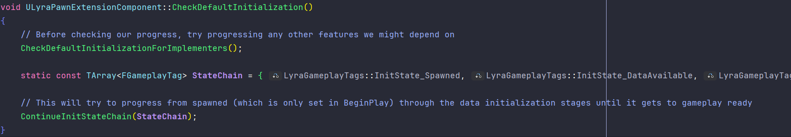

  做了两件事:

  首先调用CheckDefaultInitializationForImplementers函数. 这个函数做的事情就是调用除了自己以外所有人的CheckDefaultInitialization函数. (那显然, 如果有两个组件都在CheckDefaultInitialization中无条件调用CheckDefaultInitializationForImplementers函数, 将会导致循环调用.)

  其次是ContinueInitStateChain, 也就是推进初始化链, 跟前面说的一样, 从CanChangeInitState开始走:

  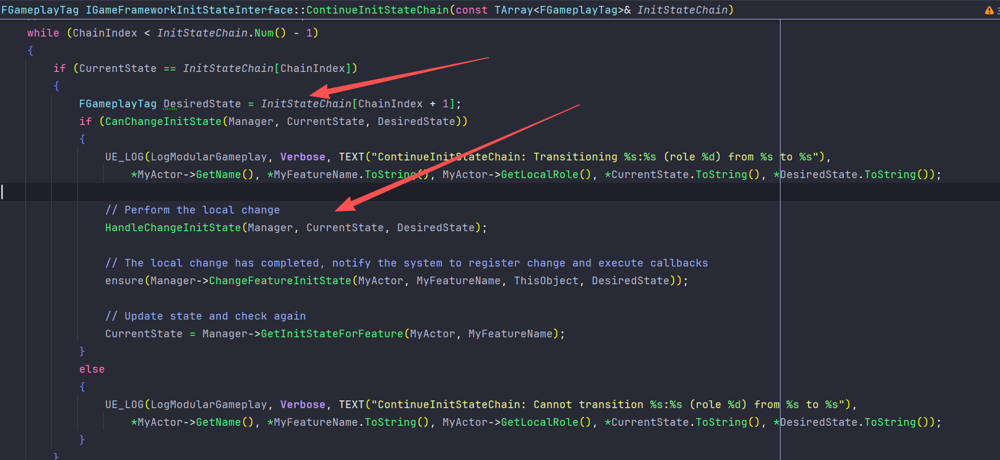

  这个CheckDefaultInitialization函数很关键, 不止是在别人状态变化的时候调用, 在其他很多地方也会被大量调用, 下面会提到.
- 在Lyra中, 初始化链有四个状态: InitState_Spawned, InitState_DataAvailable, InitState_DataInitialized, InitState_GameplayReady. 不过其实真正用上的也就两三个.

  需要在GameInstance中注册这四个状态, 才能让框架识别他们的顺序.

  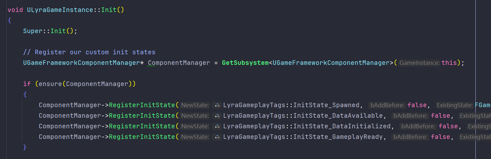

## PawnExtComp和HeroComp的初始化

- 两者合并起来讲, 可以更好感受到状态的流转.

- 首先, PawnExtComp将自己注册到GameFrameworkInitState框架(在OnRegister函数中实现), 然后在BeginPlay中监听所有人的InitState变化, 将自己的InitState置为Spawned, 然后开始推进初始化. 

  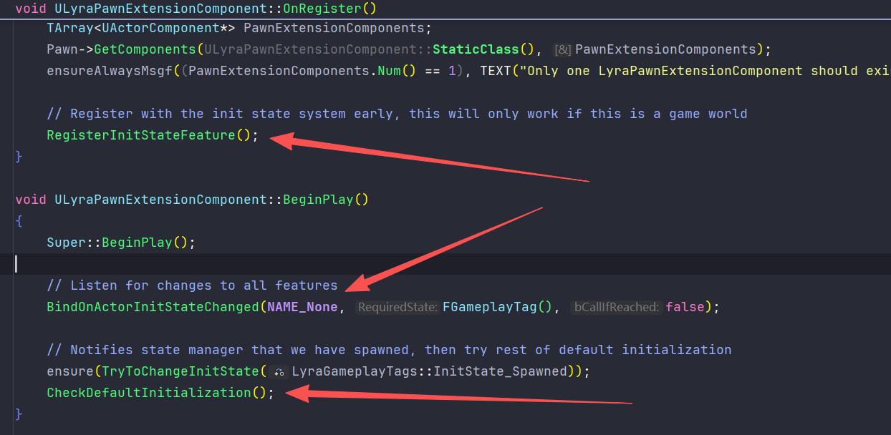

  HeroComp也是一样的流程. 基本上, 使用这个框架来初始化的组件, 都走"OnRegister注册->BeginPlay开始推进"这一套流程. 不过别的组件未必就会监听其他组件的InitState变化, PawnExtComp是比较特殊的, 他是核心组件, 负责推进所有人的初始化. 而HeroComp则监听了PawnExtComp的状态变化.

  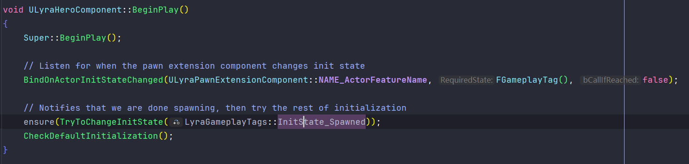

  另外, 状态转为Spawned也是有条件的, HeroComp和PawnExtComp设定的条件都是只要有Pawn, 就返回true, 所以基本相当于无条件了.
- PawnExtComp和HeroComp的初始化流程如下图所示:

  - PawnExtComp:

    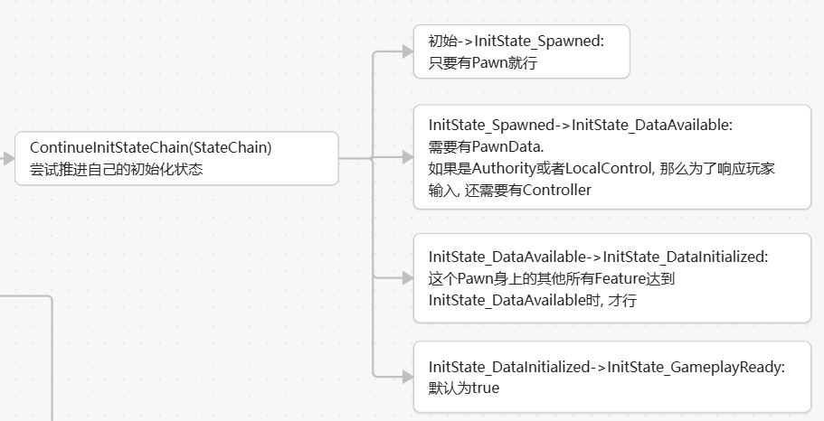
  - HeroComp:

    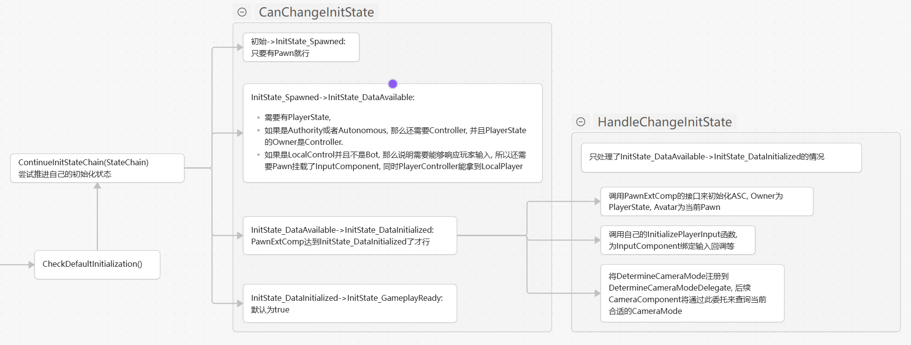

    另外, 当PawnExtComp到达Initialized时, 会再推动一次HeroComp的初始化. (前面提到过, HeroComp有监听PawnExtComp的状态变化)

    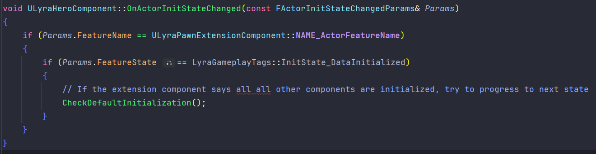

  不过, 并不是调用了一次CheckDefault函数, 初始化链就这样一直往下推进, 而是每调用一次CheckDefault, 就会尝试从当前状态往后推进. 尝试的结果可能是推进失败, 也可能推进了一个状态, 也可能连续推进了几个状态. 所以, 为了确保完整的推进流程, 需要多次在恰当的时机调用CheckDefault函数.

  - 这里所说"恰当的时机", 是通过组件初始化流程中需要的数据来判断的. 比如通过上面的图可以知道, 初始化需要PlayerState, PlayerController, InputComponent等等, 那么**恰当的时机就是Character类中的OnRep_PlayerState, PossessedBy, OnRep_PlayerController, SetupInputComponent等函数**了.

  - 并且, 由于PawnExtComp的CheckDefault函数中也会调用其他所有人的CheckDefault函数, 因此我们**只需要调用PawnExtComp的CheckDefault函数**就好了.

  所以, LyraCharacter就是在**恰当的时机**, 调用PawnExtComp的**CheckDefault**函数. 这也是很多组件可以不写在LyraCharacter中, 而是由PawnExtComp来拓展的核心前提.

  最后, 可以注意一下HeroComp的HandleChangeInitState, 其中提到的三个操作, 第二个操作在前面InputComponent中讲了, 第三个操作在Camera的文章讲了, 而第一个操作, 其实就是调用下面提到的InitializeAbilitySystem函数.

## ASC初始化

PawnExtComp提供了初始化ASC的接口: **InitializeAbilitySystem**. 这个函数仅在HeroComponent中被调用一次, 上面已提到过.

这里的初始化主要是指**刷新ASC的AvatarActor信息**. ASC的OwnerActor一直是PlayerState, 但是ASC的AvatarActor可能经常改变, 比如切换角色. 这时候要清除ASC中旧的AvatarActor, 指定为当前PawnExtComp所在的Pawn.

刷新完之后, 就会广播上面这个OnAbilitySystemInitialized委托. LyraCharacter给这个委托注册了回调函数. 当这个委托被广播, LyraCharacter就会初始化HealthComp.

---

对关键Component的理解到此基本完成. 你会发现整个初始化流程需要很多数据, 这些数据都通过PawnData指定.

组件们从PawnExtComp中取得PawnData, 再从PawnData取得这些数据.

# PawnData

下面是一个简单的PawnData资产:

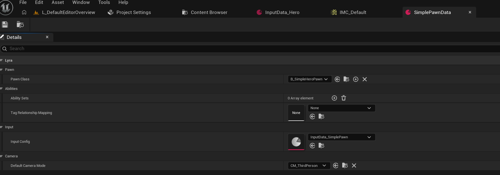

指定了要生产的Pawn类, 这个开头提到了.

指定了Ability相关, 在PlayerState中, 会将AbilitySet中的Ability都赋予ASC.

指定InputConfig, 前面讲了, 主要是实现InputAction到回调函数的映射.

指定默认的CameraMode. 这块在Camera文章中有提及.

PawnData本身需要在ExperienceDefinition中指定.

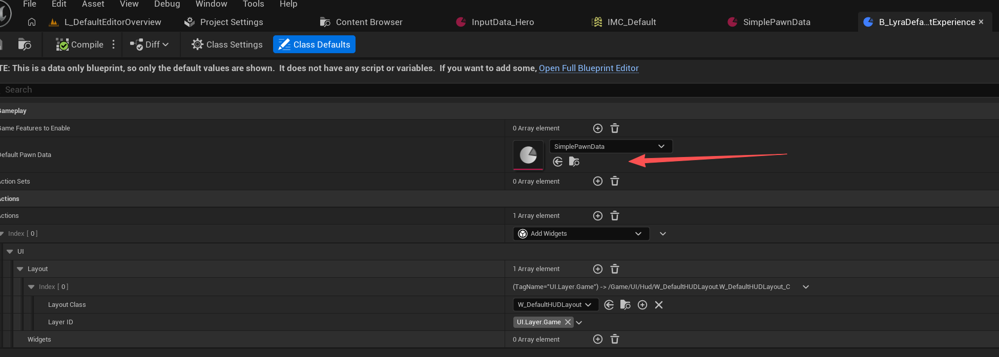

然后在Experience加载的时候将这个PawnData赋予PlayerState和PawnExtensionComp.

# 总结

完整梳理一遍整个角色生成流程:

游戏外:

- 创建PawnData资产, 在其中指定InputConfig, CameraMode, PawnClass等. 然后在Experience资产中指定这个PawnData资产.
- 项目设置要指定DefaultInputComponent为我们创建的LyraInputComponent. GameMode, Controller之类的也要设置成我们自己的.

游戏内:

- Experience加载完成时, 触发回调.

  GameMode会Restart所有"没有Pawn的PlayerController", 生成Pawn, 将前面指定好的PawnData设置给这个Pawn的PawnExtComp.

  PlayerState同样有个回调, 拿到PawnData, 将其中指定的Ability相关内容赋予ASC.

  (ASC在PlayerState构造函数中就已经创建, 在PlayerState的PostInitializeComponent中已完成初始化. HeroComponent会再做一次初始化, 理由已经提过, PlayerState不变, 但Pawn可能经常变)
- 开始走Character. PawnExtComp和HeroComp都会注册到GameFrameworkInitState框架, BeginPlay开始尝试推进初始化进程. Character在恰当时机调用PawnExtComp的CheckDefault函数, 多次尝试推动所有组件的初始化进程.

  HeroComp中完成ASC的再次初始化, 注册CameraMode查询委托, 配合InputComponent完成输入绑定.

  PawnExtComp负责推动HeroComp和ASC等其他组件的初始化, 提供PawnData让他们读取.

虽然搞半天只实现了很简单的人物生成和控制, 但梳理下来整个流程还是挺复杂的, 而且也有很多细节没讲, 比如网络同步这块, 还有GAS的很多内容也是一笔带过, 后续都会深入了解, 也会发文章的.
